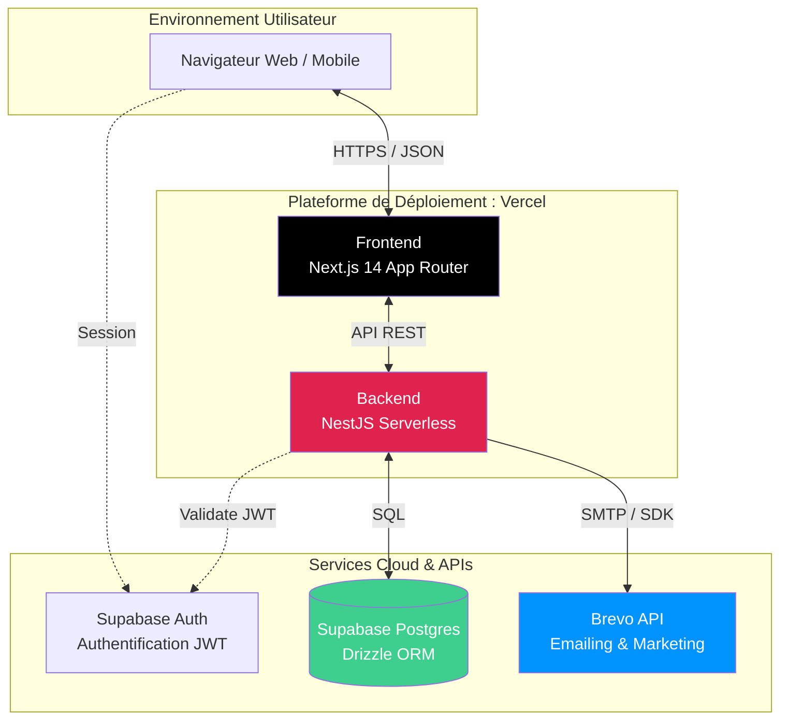
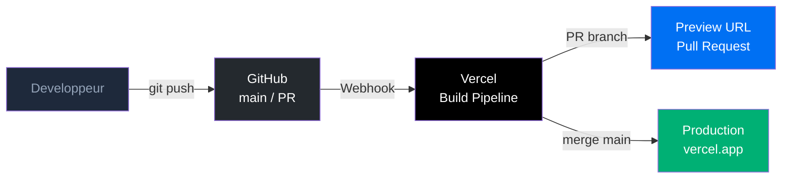

# CRM Pro

> Plateforme CRM Full SaaS — Gestion des contacts, pipeline de vente et automatisation marketing.


---

## Table des matières

1. [Présentation](#1-présentation)
2. [Architecture](#2-architecture)
3. [Stack technique](#3-stack-technique)
4. [Structure du projet](#4-structure-du-projet)
5. [Sécurité et middleware](#5-sécurité-et-middleware)
6. [Installation et lancement](#6-installation-et-lancement)
7. [Variables d'environnement](#7-variables-denvironnement)
8. [Tests unitaires](#8-tests)
9. [CI/CD et déploiement](#9-cicd-et-déploiement)
10. [Documentation technique](#10-documentation-technique)

---

## 1. Présentation

**CRM Pro** est une application SaaS de gestion de la relation client construite sur une architecture monorepo moderne. Elle permet à des équipes commerciales de piloter l'intégralité de leur cycle de vente depuis un tableau de bord unifié.

| Module | Description |
|--------|-------------|
| **Dashboard** | KPIs en temps réel : CA du mois, taux de conversion, pipeline, tâches |
| **Contacts** | Fiche contact complète, historique des interactions, segmentation |
| **Entreprises** | Gestion des comptes clients, hiérarchie contacts/entreprises |
| **Pipeline** | Kanban interactif par étape commerciale avec drag & drop |
| **Leads** | Suivi des opportunités avec scoring et probabilité |
| **Tâches** | Calendrier, rappels, rendez-vous avec centre de notifications |
| **Campagnes** | Automatisation d'emails marketing via Brevo |
| **Paramètres** | Gestion des utilisateurs, rôles et préférences |

---

## 2. Architecture



---

## 3. Stack technique

### Frontend — `./frontend`

| Technologie | Version | Rôle |
|-------------|---------|------|
| **Next.js** | 14 | Framework React, App Router, Server Components |
| **TypeScript** | 5 | Typage statique de bout en bout |
| **Tailwind CSS** | 3 | Utility-first CSS, design system dark slate |
| **Shadcn/UI** | latest | Composants accessibles (Dialog, Badge…) |
| **React Hook Form** | 7 | Gestion des formulaires |
| **Zod** | 3 | Validation des schémas côté client |
| **Recharts** | 2 | Graphiques (dashboard, funnel) |

### Backend — `./backend`

| Technologie | Version | Rôle |
|-------------|---------|------|
| **NestJS** | 10 | Framework Node.js modulaire |
| **TypeScript** | 5 | Typage statique |
| **Drizzle ORM** | latest | ORM type-safe pour PostgreSQL |
| **Class-Validator** | latest | Validation des DTOs entrants |
| **Passport / JWT** | latest | Authentification via strategy JWT |

### Services externes

| Service | Usage |
|---------|-------|
| **Supabase Auth** | Authentification utilisateurs (JWT, sessions PKCE) |
| **Supabase PostgreSQL** | Base de données relationnelle hébergée |
| **Brevo API** | Envoi de campagnes email marketing |
| **Vercel** | Hébergement frontend + backend (Serverless Functions) |

---

## 4. Structure du projet

```
crm/
├── frontend/                    # Application Next.js 14
│   ├── src/
│   │   ├── app/                 # App Router — pages et layouts
│   │   │   ├── (dashboard)/     # Groupe de routes protégées
│   │   │       ├── layout.tsx   # Layout global (Header, Sidebar, Auth)
│   │   │       ├── dashboard/
│   │   │       ├── contacts/
│   │   │       ├── companies/
│   │   │       ├── pipeline/
│   │   │       ├── leads/
│   │   │       ├── tasks/
│   │   │       ├── settings/
│   │   │       ├── profile/
│   │   │       └── campaigns/
│   │   │   └── (auth)/          # Connexion, création de compte, etc.
│   │   │       ├── forgot-password/
│   │   │       ├── login/
│   │   │       ├── register/
│   │   │       └── update-password/
│   │   ├── components/          # Composants réutilisables
│   │   ├── hooks/               # Hooks personnalisés (useAuth, useTasks…)
│   │   ├── services/            # Couche d'appel API
│   │   ├── lib/                 # Utilitaires (api.ts, utils.ts)
│   │   ├── types/               # Types TypeScript unifiés
│   │   └── middleware.ts        # Protection des routes (Supabase session)
│   ├── Dockerfile.dev
│   └── .env.local
│
├── backend/                     # API NestJS
│   ├── src/
│   │   ├── auth/                # JwtStrategy, JwtAuthGuard, RolesGuard
│   │   ├── dashboard/           # KPIs, activité, segmentation
│   │   ├── contacts/
│   │   ├── companies/
│   │   ├── leads/
│   │   ├── pipeline/
│   │   ├── tasks/
│   │   ├── notifications/
│   │   ├── campaigns/           # Intégration Brevo
│   │   ├── database/            # db.config.ts, schema.ts (Drizzle)
│   │   └── app.module.ts
│   ├── scripts/                 # Exemples de template d'envoie d'email
│   ├── Dockerfile.dev
│   └── .env
│
├── docs/
│   ├── doc_technique.md         # MCD, use cases, diagrammes de séquences
│   ├── mcd.mermaid
│   ├── use_cases/               # Diagrammes cas d'utilisation (.mermaid / .png)
│   └── sequences/               # Diagrammes de séquences (.mermaid / .png)
│
├── .github/
│   └── workflows/
│       └── generate-diagrams.yml
├── docker-compose.yml
└── README.md
```

---

## 5. Sécurité et middleware

### `frontend/src/middleware.ts` — Protection des routes

Le fichier `middleware.ts` s'exécute à la **couche Edge de Vercel**, avant le rendu de la page. Il assure deux rôles :

**Rafraîchissement automatique des sessions Supabase** — à chaque requête, le token JWT est rafraîchi si expiré, garantissant une session continue sans interruption.

**Protection des routes du dashboard** — toutes les routes sous `/(dashboard)/*` sont protégées. Un utilisateur non authentifié est redirigé vers `/login`. L'accès à `/settings` est restreint au rôle `admin`.

```
Requête navigateur
      |
      v
middleware.ts (Edge)
      |
      +-- createServerClient(Supabase) --> Rafraîchit le token si expiré
      |
      +-- session présente ? --Non--> redirect('/login')
      |
      +-- session valide ? --Oui--> Laisse passer la requête
```

### Gestion des rôles (Backend)

Le backend NestJS implémente un double garde d'accès :

```typescript
@UseGuards(JwtAuthGuard, RolesGuard)
@Roles('admin')
```

| Garde | Rôle |
|-------|------|
| `JwtAuthGuard` | Valide la signature du JWT Supabase (`SUPABASE_JWT_PUBLIC_KEY`) |
| `RolesGuard` | Vérifie le champ `role` du payload JWT (`admin` / `commercial`) |

Le filtre par rôle s'applique également aux requêtes SQL : un commercial ne voit que les leads et tâches qui lui sont assignés (`WHERE assigned_to = $userId`), un admin voit toutes les données.

---

## 6. Installation et lancement

### Prérequis

- Docker Desktop >= 4.x ou Docker Engine + Compose v2.22+
- Node.js >= 20 (pour l'installation manuelle)
- Compte Supabase et compte Brevo

### Option A — Docker (recommandé)

```bash
# 1. Cloner le dépôt
git clone https://github.com/uciie/crm
cd crm

# 2. Configurer les variables d'environnement
cp backend/.env.example backend/.env
cp frontend/.env.local.example frontend/.env.local
# Remplir les valeurs dans les deux fichiers .env

# 3. Démarrer tous les services
docker compose up --build

# 4. Mode watch — hot-reload natif (Compose v2.22+)
docker compose watch
```

| Service | URL |
|---------|-----|
| Frontend | http://localhost:3000 |
| Backend API | http://localhost:3001 |
| Health check | http://localhost:3001/health |

### Option B — Installation manuelle

```bash
# Backend
cd backend
npm install
npm run start:dev

# Frontend (dans un second terminal)
cd frontend
npm install
npm run dev
```

### Docker Compose watch — comportement

| Evenement | Action |
|-----------|--------|
| Modification dans `src/` | `sync` — copie instantanée dans le conteneur |
| Modification de `package.json` | `rebuild` — reconstruction de l'image |

---

## 7. Variables d'environnement

### Backend — `backend/.env`

```env
# Serveur
PORT=3001
FRONTEND_URL=http://localhost:3000
NODE_ENV=development

# Supabase
SUPABASE_URL=https://<votre-projet>.supabase.co
SUPABASE_JWT_PUBLIC_KEY=<votre-jwt-secret>
SUPABASE_SERVICE_ROLE_KEY=<votre-service-role-key>

# Base de données
DATABASE_URL="postgresql://postgres.<ref>:<password>@aws-0-<region>.pooler.supabase.com:6543/postgres"

# Brevo
BREVO_API_KEY=<votre-cle-api-brevo>
BREVO_SENDER_EMAIL=<expediteur@domaine.fr>
BREVO_SENDER_NAME=CRM

# Templates Brevo (IDs numeriques crees dans l'interface Brevo)
BREVO_WELCOME_TEMPLATE_ID=<id>
BREVO_LEAD_ASSIGNED_TEMPLATE_ID=<id>
BREVO_TASK_ASSIGNED_TEMPLATE_ID=<id>

BREVO_TEMPLATE_DEAL_STAGE_CHANGED=<id>
BREVO_TEMPLATE_LEAD_WON=<id>
BREVO_TEMPLATE_LEAD_LOST=<id>

BREVO_TPL_NEWSLETTER=<id>
BREVO_TPL_PROMO=<id>
BREVO_TPL_RELANCE=<id>
BREVO_TPL_ONBOARDING=<id>

BREVO_LIST_ID=<id-liste-contact>
BREVO_SENDER_ID=<id-sender>
BREVO_CAMPAIGN_SENDER_ID=<id-sender-campagne>
BREVO_SMTP_HOST=smtp-relay.brevo.com
BREVO_SMTP_PORT=<port.>
BREVO_SMTP_USER=<id>@smtp-brevo.com
BREVO_SMTP_PASS=<votre-cle-api-SMTP>
```

| Variable | Description | Ou la trouver |
|----------|-------------|---------------|
| `SUPABASE_URL` | URL du projet Supabase | Dashboard > Settings > API |
| `SUPABASE_JWT_PUBLIC_KEY` | Secret de signature des JWT (HS256) | Dashboard > Settings > API > JWT Secret |
| `SUPABASE_SERVICE_ROLE_KEY` | Cle service role — ne jamais exposer cote client | Dashboard > Settings > API |
| `DATABASE_URL` | Chaine de connexion PostgreSQL via pooler | Dashboard > Settings > Database |
| `BREVO_API_KEY` | Cle API Brevo | Brevo > SMTP & API > API Keys |
| `BREVO_TEMPLATE_*` | Identifiants numeriques des templates email | Brevo > Email > Templates |

> `SUPABASE_JWT_PUBLIC_KEY` dans le `.env` correspond au champ `SUPABASE_JWT_SECRET` dans `jwt.strategy.ts`. Les deux noms désignent le même secret HS256.

### Frontend — `frontend/.env.local`

```env
NEXT_PUBLIC_SUPABASE_URL=https://<votre-projet>.supabase.co
NEXT_PUBLIC_SUPABASE_ANON_KEY=<votre-cle-anon>
NEXT_PUBLIC_API_URL=http://localhost:3001
```

| Variable | Description |
|----------|-------------|
| `NEXT_PUBLIC_SUPABASE_URL` | URL publique Supabase — exposee au navigateur |
| `NEXT_PUBLIC_SUPABASE_ANON_KEY` | Cle anonyme Supabase — non privilegiee, usage client uniquement |
| `NEXT_PUBLIC_API_URL` | URL du backend accessible depuis le navigateur |

> Les variables prefixees `NEXT_PUBLIC_` sont compilees dans le bundle JavaScript. Ne jamais y placer la `SUPABASE_SERVICE_ROLE_KEY`.

---

## 8. Tests

Les tests unitaires couvrent la couche **service** du backend (logique métier, contrôle d'accès, triggers email). Ils utilisent **Jest** avec des mocks complets de la base de données et de l'`EmailService`, garantissant une exécution rapide et sans dépendance réseau.

### Lancer les tests au backend ou frontend

```bash
cd backend # ou cd frontend

# Tous les tests
npm run test

# Un seul fichier
npm run test -- leads.service.spec
```

### Exemple de fichiers de tests

```
backend/src/
├── leads/
│   └── leads.service.spec.ts      # cas — LeadsService
└── pipeline/
    └── pipeline.service.spec.ts   # cas — PipelineService
frontend/src/components/
└── auth /
    └── AuthGuard.test.tsx
```

### Configuration Jest (`jest.config.ts`)

```typescript
export default {
  moduleFileExtensions: ['js', 'json', 'ts'],
  rootDir:              'src',
  testRegex:            '.*\\.spec\\.ts$',
  transform:            { '^.+\\.(t|j)s$': 'ts-jest' },
  collectCoverageFrom:  ['**/*.(t|j)s'],
  coverageDirectory:    '../coverage',
  testEnvironment:      'node',
}
```

### Stratégie de mock

La base de données (`db`) est entièrement mockée via `jest.mock()` — aucune connexion réelle à Supabase n'est établie lors des tests. L'`EmailService` est mocké séparément pour vérifier les triggers Brevo sans appel réseau. Les emails fire-and-forget (non bloquants) sont validés via `setImmediate()`.

---

## 9. CI/CD et déploiement

### Workflow de déploiement continu



**Frontend** — Vercel détecte Next.js automatiquement, produit des Server Components et des Edge Functions, et distribue les assets depuis son CDN mondial. Chaque Pull Request génère une URL de prévisualisation unique.

**Backend** — NestJS déployé en Serverless Functions via `vercel.json` à la racine de `/backend`.

### Environnements

| Branche | Environnement | URL |
|---------|---------------|-----|
| `main` | Production | https://crm-zeta-rosy.vercel.app |

### Génération automatique des diagrammes

Un workflow GitHub Actions (`.github/workflows/generate-diagrams.yml`) génère les PNG à partir des fichiers `.mermaid` à chaque push sur `main` :

```
docs/mcd.mermaid          ->  docs/mcd.png
docs/use_cases/*.mermaid  ->  docs/use_cases/*.png
docs/sequences/*.mermaid  ->  docs/sequences/*.png
```

---

## 10. Documentation technique

La documentation technique détaillée est disponible dans [`docs/doc_technique.md`](docs/doc_technique.md).

Elle contient le modèle de données complet (MCD) avec légende, les diagrammes de cas d'utilisation par module, les diagrammes de séquences (authentification, contacts, leads, pipeline, tâches, campagnes, administration), le référentiel des endpoints API et le détail des rôles et permissions.

---

## Licence

MIT — voir [LICENSE](./LICENSE)

---

*Documentation générée pour CRM*
