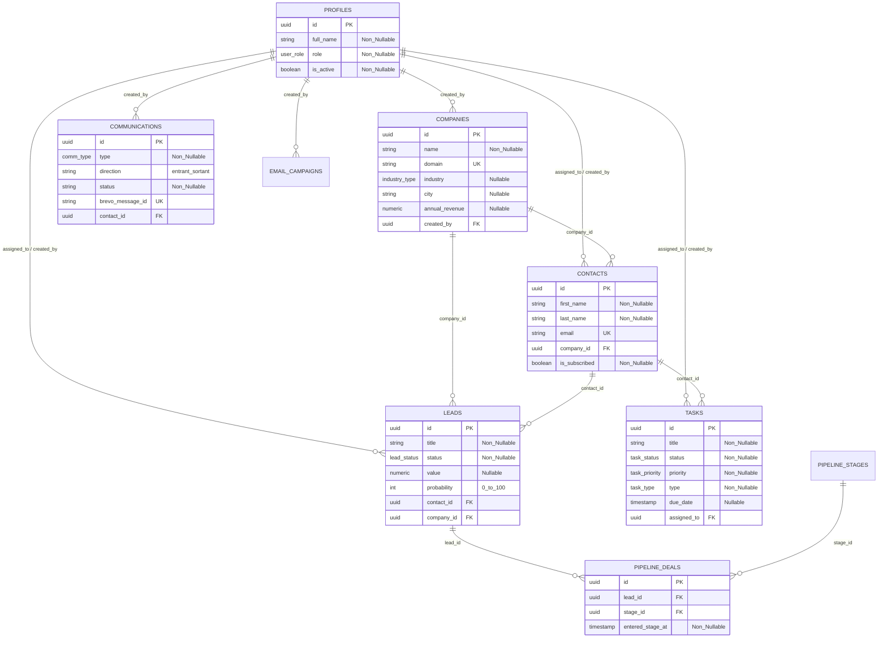
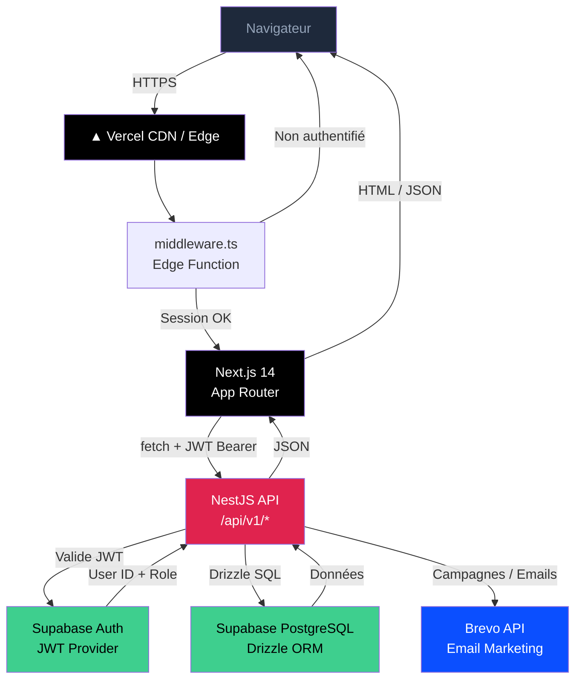
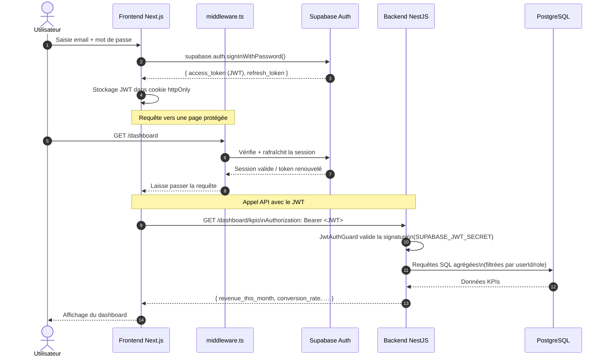
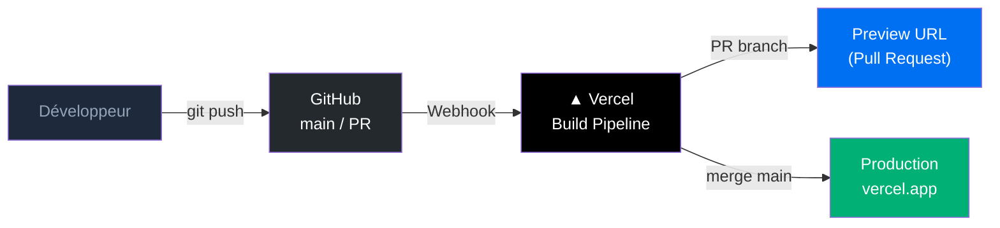

# CRM Pro — Documentation Technique

> Plateforme CRM Full SaaS moderne — Gestion des contacts, pipeline de vente et automatisation marketing.


---

## Table des matières

1. [Présentation du projet](#1-présentation-du-projet)
2. [Architecture technique](#2-architecture-technique)
3. [Structure du monorepo](#3-structure-du-monorepo)
4. [Schéma de données](#4-schéma-de-données)
5. [Sécurité et middleware](#5-sécurité-et-middleware)
6. [Installation et lancement](#6-installation-et-lancement)
7. [Variables d'environnement](#7-variables-denvironnement)
8. [Fonctionnalités clés](#8-fonctionnalités-clés)
9. [Diagrammes](#9-diagrammes)
10. [CI/CD et déploiement](#10-cicd-et-déploiement)

---

## 1. Présentation du projet

**CRM Pro** est une application SaaS de gestion de la relation client (CRM) construite sur une architecture monorepo moderne. Elle permet à des équipes commerciales de piloter l'intégralité de leur cycle de vente depuis un tableau de bord unifié.

### Périmètre fonctionnel

| Module | Description |
|--------|-------------|
| **Dashboard** | KPIs en temps réel : CA du mois, taux de conversion, pipeline, tâches |
| **Contacts** | Fiche contact complète, historique des interactions, segmentation |
| **Entreprises** | Gestion des comptes clients, hiérarchie contacts/entreprises |
| **Pipeline** | Kanban interactif par étape commerciale (Kanban drag & drop) |
| **Leads** | Suivi des opportunités avec scoring et probabilité |
| **Tâches** | Calendrier, rappels, rendez-vous avec centre de notifications |
| **Campagnes** | Automatisation d'emails marketing via Brevo |
| **Paramètres** | Gestion des utilisateurs, rôles et préférences |

---

## 2. Architecture technique

### Vue d'ensemble


### Stack technique

#### Frontend — `./frontend`

| Technologie | Version | Rôle |
|-------------|---------|------|
| **Next.js** | 14 | Framework React, App Router, Server Components |
| **TypeScript** | 5 | Typage statique de bout en bout |
| **Tailwind CSS** | 3 | Utility-first CSS, design system dark slate |
| **Lucide React** | 0.263 | Bibliothèque d'icônes SVG |
| **Shadcn/UI** | latest | Composants accessibles (Dialog, Badge…) |
| **React Hook Form** | 7 | Gestion des formulaires |
| **Zod** | 3 | Validation des schémas côté client |
| **Recharts** | 2 | Graphiques (dashboard, funnel) |

#### Backend — `./backend`

| Technologie | Version | Rôle |
|-------------|---------|------|
| **NestJS** | 10 | Framework Node.js modulaire |
| **TypeScript** | 5 | Typage statique |
| **Drizzle ORM** | latest | ORM type-safe pour PostgreSQL |
| **Class-Validator** | latest | Validation des DTOs entrants |
| **Class-Transformer** | latest | Sérialisation des réponses |
| **Passport / JWT** | latest | Authentification via strategy JWT |
| **@nestjs/config** | latest | Gestion des variables d'environnement |

#### Services externes

| Service | Usage |
|---------|-------|
| **Supabase Auth** | Authentification utilisateurs (JWT, sessions) |
| **Supabase PostgreSQL** | Base de données relationnelle hébergée (Neon) |
| **Brevo API** | Envoi de campagnes email marketing |
| **Vercel** | Hébergement frontend + backend (Serverless Functions) |

---

## 3. Structure du crm

```
crm/
├── frontend/                    # Application Next.js 14
│   ├── src/
│   │   ├── app/                 # App Router — pages et layouts
│   │   │   ├── (dashboard)/     # Groupe de routes protégées
│   │   │   │   ├── layout.tsx   # Layout global (Header, Sidebar, Auth)
│   │   │   │   ├── dashboard/   # Page tableau de bord
│   │   │   │   ├── contacts/    # CRUD contacts
│   │   │   │   ├── companies/   # CRUD entreprises
│   │   │   │   ├── pipeline/    # Kanban pipeline
│   │   │   │   ├── leads/       # Gestion des opportunités
│   │   │   │   ├── tasks/       # Tâches et calendrier
│   │   │   │   └── campaigns/   # Campagnes email
│   │   ├── components/          # Composants réutilisables
│   │   │   ├── dashboard/       # StatsCard, ConversionChart, ActivityFeed
│   │   │   ├── tasks/           # TaskList, CalendarView, NotificationCenter
│   │   │   ├── layout/          # Header, Sidebar, MobileNav
│   │   │   └── ui/              # Primitives (Button, Badge, Modal, Toast…)
│   │   ├── hooks/               # Hooks personnalisés (useAuth, useTasks…)
│   │   ├── services/            # Couche d'appel API (tasks.service.ts…)
│   │   ├── lib/                 # Utilitaires (api.ts, utils.ts, task-config.ts)
│   │   ├── types/               # Types TypeScript unifiés (index.ts)
│   │   └── middleware.ts        # Protection des routes (Supabase session)
│   ├── Dockerfile.dev
│   └── .env.local
│
├── backend/                     # API NestJS
│   ├── src/
│   │   ├── auth/                # JwtStrategy, JwtAuthGuard, RolesGuard
│   │   ├── dashboard/           # KPIs, activité, segmentation, LTV
│   │   ├── contacts/            # CRUD contacts + filtres
│   │   ├── companies/           # CRUD entreprises
│   │   ├── leads/               # CRUD opportunités
│   │   ├── pipeline/            # Kanban, déplacement de deals
│   │   ├── tasks/               # CRUD tâches + toggle
│   │   ├── notifications/       # Centre de notifications (calculé à la volée)
│   │   ├── campaigns/           # Intégration Brevo
│   │   ├── database/            # db.config.ts, schema.ts (Drizzle)
│   │   └── app.module.ts        # Module racine NestJS
│   ├── Dockerfile.dev
│   └── .env
│
├── docker-compose.yml           # Orchestration dev (watch natif)
└── README.md
```

---

## 4. Schéma de données

### Diagramme Entité-Relation (ER)


#### Légende Technique

| Sigle | Type | Description |
| --- | --- | --- |
| **PK** | **Primary Key** | Identifiant unique (UUID) généré par `uuid_generate_v4()`. |
| **FK** | **Foreign Key** | Relation vers une autre table (Contrainte d'intégrité). |
| **UK** | **Unique Key** | Valeur unique obligatoire (ex: Email, Domaine). |
| **"Non_Nullable"** | **Obligatoire** | Champ `NOT NULL` requis pour la validation. |
| **"Nullable"** | **Optionnel** | Champ pouvant être nul dans la base de données. |


#### Les relations structurantes du schema sont les suivantes :

- Une `company` peut avoir plusieurs `contacts`. Un contact appartient a une seule entreprise.
- Un `contact` genere des `leads` (opportunites commerciales). Un lead est lie a la fois a un contact et a une entreprise.
- Un `lead` est transforme en `deal` dans le pipeline de vente. La table `pipeline_deals` materialise cette transformation en associant un lead a une etape (`pipeline_stages`). L'horodatage `entered_stage_at` permet de mesurer le temps passe a chaque etape.
- Les `tasks` et `communications` peuvent etre rattachees a la fois a un contact et a un lead, permettant un historique complet de l'activite commerciale autour d'une opportunite.

---

## 5. Sécurité et middleware

### `frontend/src/middleware.ts` — Protection des routes

Le fichier `middleware.ts` est exécuté à la **couche Edge de Vercel**, avant même le rendu de la page. Il remplit deux rôles :

**1. Rafraîchissement automatique des sessions Supabase**

À chaque requête, le middleware récupère la session Supabase depuis les cookies et la rafraîchit si le token JWT est expiré. Cela garantit que l'utilisateur reste authentifié sans interruption même après une longue inactivité.

```
Requête navigateur
      │
      v
middleware.ts (Edge)
      │
      ├─ createServerClient(Supabase) ─> Rafraîchit le token si expiré
      │
      ├─ session présente ? ──Non──> redirect('/login')
      │
      └─ session valide ? ──Oui──> Laisse passer la requête
```

**2. Protection des routes du dashboard**

Toutes les routes sous `/(dashboard)/*` sont protégées. Un utilisateur non authentifié est automatiquement redirigé vers `/login`. L'accès aux pages d'administration (`/settings`) est restreint au rôle `admin`.

### Gestion des rôles (Backend)

Le backend NestJS implémente un double garde d'accès :

```typescript
// Combinaison des deux gardes sur chaque endpoint sensible
@UseGuards(JwtAuthGuard, RolesGuard)
@Roles('admin')
```

| Garde | Rôle |
|-------|------|
| `JwtAuthGuard` | Valide la signature du JWT Supabase (`SUPABASE_JWT_PUBLIC_KEY`) |
| `RolesGuard` | Vérifie le champ `role` du payload JWT (`admin` / `commercial`) |

Le filtre par rôle s'applique également aux **requêtes SQL** : un commercial ne voit que les leads et tâches qui lui sont assignés (`WHERE assigned_to = $userId`), un admin voit toutes les données.

---

## 6. Installation et lancement

### Prérequis

- Docker Desktop ≥ 4.x ou Docker Engine + Compose v2.22+
- Node.js ≥ 20 (pour l'installation manuelle)
- Compte Supabase, compte Brevo

### Option A — Docker (recommandé)

```bash
# 1. Cloner le dépôt
git clone https://github.com/uciie/crm
cd crm

# 2. Configurer les variables d'environnement
cp backend/.env.example backend/.env
cp frontend/.env.local.example frontend/.env.local
# Remplir les valeurs dans les deux fichiers .env

# 3. Démarrer tous les services
docker compose up --build

# 4. Mode watch — hot-reload natif (Compose v2.22+)
docker compose watch
```

| Service | URL |
|---------|-----|
| Frontend | http://localhost:3000 |
| Backend API | http://localhost:3001 |
| Health check | http://localhost:3001/health |

### Option B — Installation manuelle

```bash
# Backend
cd backend
npm install
npm run start:dev       # NestJS en mode watch

# Frontend (dans un second terminal)
cd frontend
npm install
npm run dev             # Next.js sur le port 3000
```

### Docker Compose watch — comportement

Le mode `docker compose watch` (Compose v2.22+) offre un hot-reload sans polling :

| Événement | Action |
|-----------|--------|
| Modification dans `src/` | `sync` — copie instantanée dans le conteneur |
| Modification de `package.json` | `rebuild` — reconstruction de l'image |

---

## 7. Variables d'environnement

### Backend — `backend/.env`

```env
# --- CONFIGURATION SERVEUR ---
PORT=3001
FRONTEND_URL=http://localhost:3000
NODE_ENV=development

# --- CONFIGURATION SUPABASE ---
SUPABASE_URL=https://<votre-projet>.supabase.co
# Secret JWT : Supabase Dashboard > Settings > API > JWT Secret
# Correspond a la variable SUPABASE_JWT_SECRET dans jwt.strategy.ts
SUPABASE_JWT_PUBLIC_KEY=<votre-jwt-secret>
# Cle service role : bypass les RLS, a ne jamais exposer cote client
SUPABASE_SERVICE_ROLE_KEY=<votre-service-role-key>

# --- BASE DE DONNEES ---
# Format Supabase pooler (port 6543, pgbouncer=true recommande en production)
DATABASE_URL="postgresql://postgres.<ref>:<password>@aws-0-<region>.pooler.supabase.com:6543/postgres"

# --- BREVO (emailing) ---
BREVO_API_KEY=<votre-cle-api-brevo>
BREVO_SENDER_EMAIL=<expediteur@domaine.fr>
BREVO_SENDER_NAME=CRM

# Identifiants des templates Brevo (crees dans l'interface Brevo)
BREVO_TEMPLATE_WELCOME=<id-template-bienvenue>
BREVO_TEMPLATE_LEAD_ASSIGNED=<id-template-lead-assigne>
BREVO_TEMPLATE_TASK_ASSIGNED=<id-template-tache-assignee>
BREVO_TEMPLATE_DEAL_STAGE_CHANGED=<id-template-etape-changee>
BREVO_TEMPLATE_LEAD_WON=<id-template-lead-gagne>
BREVO_TEMPLATE_LEAD_LOST=<id-template-lead-perdu>
```

| Variable | Description | Ou la trouver |
|---|---|---|
| `SUPABASE_URL` | URL du projet Supabase | Dashboard > Settings > API |
| `SUPABASE_JWT_PUBLIC_KEY` | Secret de signature des JWT | Dashboard > Settings > API > JWT Secret |
| `SUPABASE_SERVICE_ROLE_KEY` | Cle service role (acces admin complet) | Dashboard > Settings > API |
| `DATABASE_URL` | Chaine de connexion PostgreSQL via pooler | Dashboard > Settings > Database |
| `BREVO_API_KEY` | Cle API Brevo pour l'envoi d'emails | Brevo > SMTP & API > API Keys |
| `BREVO_TEMPLATE_*` | Identifiants numeriques des templates email | Brevo > Email > Templates |

> Note : la variable est nommee `SUPABASE_JWT_PUBLIC_KEY` dans le fichier `.env` mais elle correspond au champ `SUPABASE_JWT_SECRET` reference dans `jwt.strategy.ts`. Les deux noms designent le meme secret HS256 disponible dans Supabase Dashboard > Settings > API > JWT Secret.

### Frontend — `frontend/.env.local`

```env
# Supabase (cles publiques, exposees au navigateur)
NEXT_PUBLIC_SUPABASE_URL=https://<votre-projet>.supabase.co
NEXT_PUBLIC_SUPABASE_ANON_KEY=<votre-cle-anon>

# URL du backend
NEXT_PUBLIC_API_URL=http://localhost:3001
```

| Variable | Description |
|---|---|
| `NEXT_PUBLIC_SUPABASE_URL` | URL publique Supabase — exposee au navigateur |
| `NEXT_PUBLIC_SUPABASE_ANON_KEY` | Cle anonyme Supabase — non privilegiee, usage client uniquement |
| `NEXT_PUBLIC_API_URL` | URL du backend accessible depuis le navigateur |

> Les variables prefixees `NEXT_PUBLIC_` sont compilees dans le bundle JavaScript et accessibles publiquement. N'y placer que la cle `anon` Supabase et l'URL publique de l'API. La `SUPABASE_SERVICE_ROLE_KEY` ne doit jamais apparaitre dans une variable `NEXT_PUBLIC_*`.

---

## 8. Fonctionnalités clés

### Dashboard avec KPIs temps réel

Le dashboard agrège **8 métriques en parallèle** (`Promise.all`) depuis les tables `leads`, `tasks` et `contacts` :

- Chiffre d'affaires du mois (leads `gagné` sur la période)
- Taux de conversion (leads gagnés / total)
- Pipeline total (leads actifs hors gagné/perdu)
- Tâches en retard / urgentes distinctes
- Nouveaux contacts et contacts totaux
- Rendez-vous du jour

Un filtre de période `?startDate=&endDate=` permet d'analyser n'importe quelle plage.

### Kanban interactif

Le pipeline de vente est représenté par un **tableau Kanban** avec des colonnes configurables. Le déplacement d'un deal d'une étape à l'autre (`PATCH /pipeline/deals/:id/move`) déclenche une notification email automatique via Brevo.

### Gestion des rôles Admin / Commercial

| Fonctionnalité | Admin | Commercial |
|----------------|-------|------------|
| Voir tous les leads | ✅ | ❌ (seulement les siens) |
| Accéder aux paramètres | ✅ | ❌ |
| Créer des utilisateurs | ✅ | ❌ |
| Créer des leads/contacts | ✅ | ✅ |
| Gérer ses tâches | ✅ | ✅ |

### Centre de notifications

Les notifications sont **calculées à la volée** depuis la table `tasks` (pas de table dédiée) selon trois types : `overdue` (retard), `due_soon` (dans les 24h), `reminder` (aujourd'hui). Polling automatique toutes les 60 secondes.

---

## 9. Diagrammes

### Diagramme d'architecture — Flux de données



### Diagramme de séquence — Authentification



---

## 10. CI/CD et déploiement

### Workflow de déploiement continu

Chaque `git push` sur la branche `main` déclenche automatiquement un pipeline de déploiement via **Vercel** :



### Frontend — Vercel (Next.js natif)

Vercel est le partenaire officiel de Next.js. Le déploiement est **zéro configuration** :

1. **Push** sur `main` → Vercel détecte le framework Next.js automatiquement
2. **Build** : `next build` produit des Server Components, des Edge Functions et des assets statiques
3. **Distribution** : assets servis depuis le CDN mondial Vercel (200+ PoP)
4. **Preview deployments** : chaque Pull Request génère une URL de prévisualisation unique, permettant la revue de code visuelle avant merge

### Backend — Vercel Serverless Functions

Le backend NestJS est déployé en tant que **Serverless Functions** sur Vercel :

```
vercel.json (à la racine de /backend)
{
  "builds": [{ "src": "src/main.ts", "use": "@vercel/node" }],
  "routes": [{ "src": "/(.*)", "dest": "src/main.ts" }]
}
```

| Aspect | Détail |
|--------|--------|
| **Variables** | Injectées depuis le dashboard Vercel |

### Environnements

| Branche | Environnement | URL |
|---------|---------------|-----|
| `main` | Production | `https://crm-zeta-rosy.vercel.app` |

### Dev local avec Docker

Pour le développement local, Docker remplace Vercel :

```bash
# Démarrage complet (build initial)
docker compose up --build

# Mode watch — synchronisation fichiers sans rebuild (Compose v2.22+)
docker compose watch

# Arrêt propre
docker compose down
```

Le `healthcheck` sur le backend (`GET /health`) garantit que le frontend ne démarre qu'une fois l'API NestJS pleinement opérationnelle, évitant les erreurs de connexion au démarrage.

---

## Licence

MIT — voir [LICENSE](./LICENSE)

---

*Documentation générée pour CRM*