# Documentation technique — CRM Pro

> Ce document centralise l'ensemble des éléments techniques du projet : modèle de données, cas d'utilisation, séquences d'interactions et référentiel API.

---

## Table des matières

1. [Modèle de données (MCD)](#1-modèle-de-données-mcd)
2. [Acteurs et rôles](#2-acteurs-et-rôles)
3. [Cas d'utilisation](#3-cas-dutilisation)
4. [Diagrammes de séquences](#4-diagrammes-de-séquences)
5. [Référentiel des endpoints API](#5-référentiel-des-endpoints-api)

---

## 1. Modèle de données (MCD)

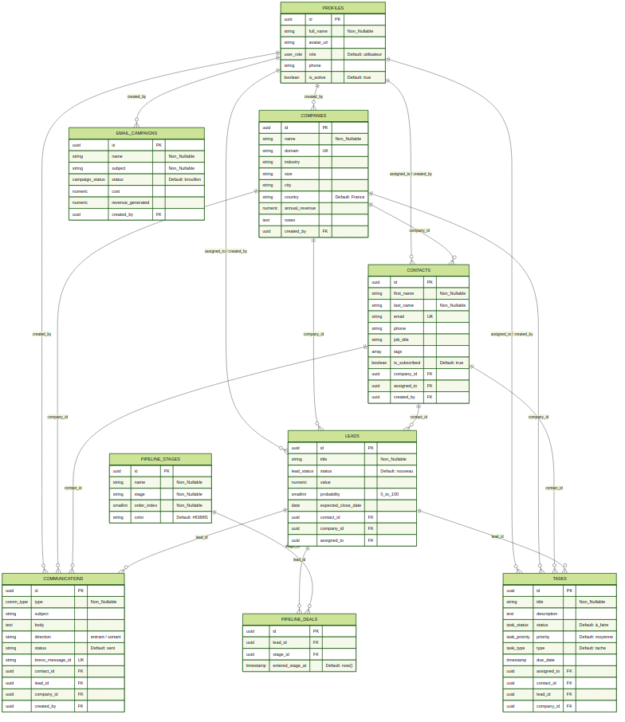

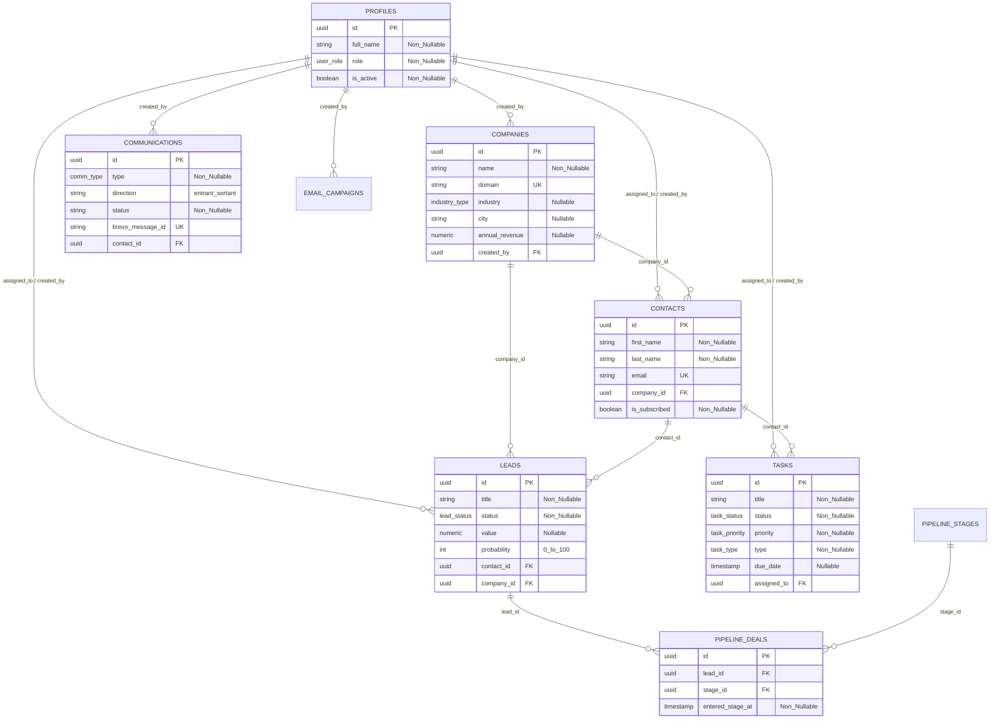
```mermaid
erDiagram
    PROFILES ||--o{ COMPANIES : "created_by"
    PROFILES ||--o{ CONTACTS : "assigned_to / created_by"
    PROFILES ||--o{ LEADS : "assigned_to / created_by"
    PROFILES ||--o{ TASKS : "assigned_to / created_by"
    PROFILES ||--o{ COMMUNICATIONS : "created_by"
    PROFILES ||--o{ EMAIL_CAMPAIGNS : "created_by"

    COMPANIES ||--o{ CONTACTS : "company_id"
    COMPANIES ||--o{ LEADS : "company_id"

    CONTACTS ||--o{ LEADS : "contact_id"
    CONTACTS ||--o{ TASKS : "contact_id"

    LEADS ||--o{ PIPELINE_DEALS : "lead_id"
    PIPELINE_STAGES ||--o{ PIPELINE_DEALS : "stage_id"

    PROFILES {
        uuid id PK
        string full_name "Non_Nullable"
        user_role role "Non_Nullable"
        boolean is_active "Non_Nullable"
    }

    COMPANIES {
        uuid id PK
        string name "Non_Nullable"
        string domain UK
        industry_type industry "Nullable"
        string city "Nullable"
        numeric annual_revenue "Nullable"
        uuid created_by FK
    }

    CONTACTS {
        uuid id PK
        string first_name "Non_Nullable"
        string last_name "Non_Nullable"
        string email UK
        uuid company_id FK
        boolean is_subscribed "Non_Nullable"
    }

    LEADS {
        uuid id PK
        string title "Non_Nullable"
        lead_status status "Non_Nullable"
        numeric value "Nullable"
        int probability "0_to_100"
        uuid contact_id FK
        uuid company_id FK
    }

    TASKS {
        uuid id PK
        string title "Non_Nullable"
        task_status status "Non_Nullable"
        task_priority priority "Non_Nullable"
        task_type type "Non_Nullable"
        timestamp due_date "Nullable"
        uuid assigned_to FK
    }

    COMMUNICATIONS {
        uuid id PK
        comm_type type "Non_Nullable"
        string direction "entrant_sortant"
        string status "Non_Nullable"
        string brevo_message_id UK
        uuid contact_id FK
    }

    PIPELINE_DEALS {
        uuid id PK
        uuid lead_id FK
        uuid stage_id FK
        timestamp entered_stage_at "Non_Nullable"
    }
```

### Légende

| Sigle | Type | Description |
|-------|------|-------------|
| **PK** | Primary Key | Identifiant unique (UUID) généré par `uuid_generate_v4()` |
| **FK** | Foreign Key | Relation vers une autre table (contrainte d'intégrité) |
| **UK** | Unique Key | Valeur unique obligatoire (ex : email, domaine) |
| `Non_Nullable` | Obligatoire | Champ `NOT NULL` requis pour la validation |
| `Nullable` | Optionnel | Champ pouvant être nul en base de données |

### Relations structurantes

Une `company` peut avoir plusieurs `contacts`. Un contact appartient à une seule entreprise.

Un `contact` génère des `leads` (opportunités commerciales). Un lead est lié à la fois à un contact et à une entreprise.

Un `lead` est transformé en `deal` dans le pipeline de vente. La table `pipeline_deals` matérialise cette transformation en associant un lead à une étape (`pipeline_stages`). L'horodatage `entered_stage_at` permet de mesurer le temps passé à chaque étape.

Les `tasks` et `communications` peuvent être rattachées à la fois à un contact et à un lead, permettant un historique complet de l'activité commerciale autour d'une opportunité.

---

## 2. Acteurs et rôles

| Acteur | Rôle DB | Périmètre d'accès |
|--------|---------|-------------------|
| **Visiteur** | — | Pages publiques uniquement (login, register, reset) |
| **Utilisateur** | `user` | Lecture contacts, tâches personnelles |
| **Commercial** | `commercial` | CRUD contacts, entreprises, leads, pipeline, tâches — lecture stats campagnes |
| **Administrateur** | `admin` | Accès complet + gestion utilisateurs + KPIs globaux |
| **Supabase Auth** | Système externe | Authentification, émission JWT, emails système |
| **Brevo** | Système externe | Envoi campagnes, webhooks entrants (événements email) |

### Matrice des permissions par module

| Fonctionnalité | Admin | Commercial | Utilisateur |
|----------------|-------|------------|-------------|
| Voir tous les leads | Oui | Non (seulement les siens) | Non |
| Créer des leads / contacts | Oui | Oui | Non |
| Accéder aux paramètres | Oui | Non | Non |
| Créer des utilisateurs | Oui | Non | Non |
| Gérer ses tâches | Oui | Oui | Oui |
| Voir les campagnes | Oui | Oui (lecture) | Non |
| Créer des campagnes | Oui | Non | Non |

---

## 3. Cas d'utilisation

### Vue de synthèse — Tous les modules

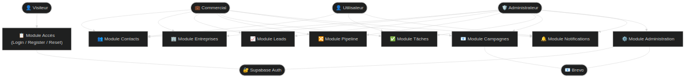

---

### Module Acces (Authentification)

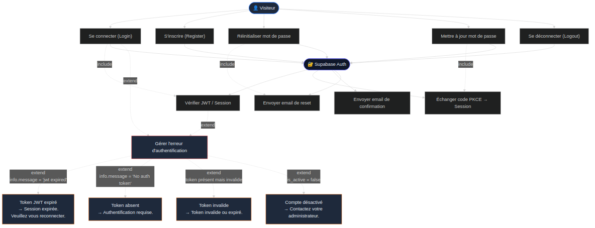

---

### Module Contacts

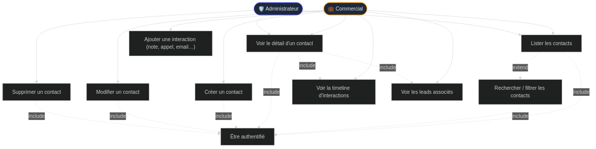

---

### Module Entreprises

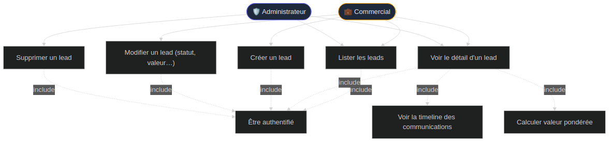

---

### Module Leads

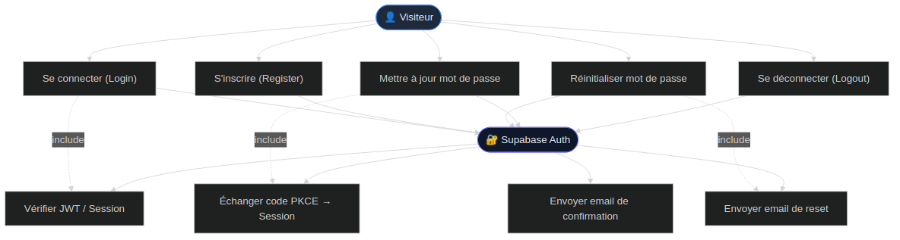

---

### Module Pipeline (Kanban)

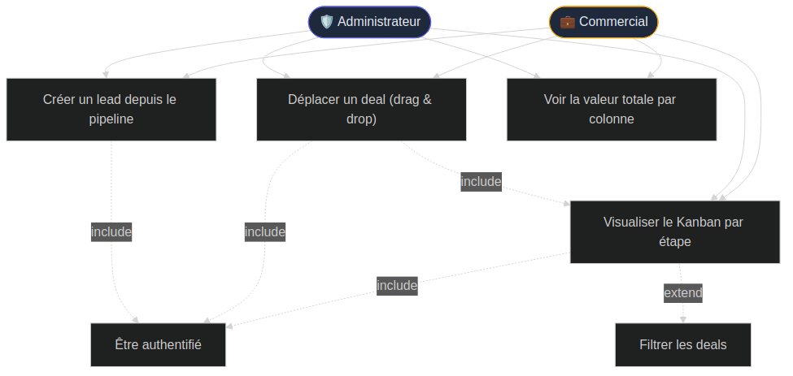

---

### Module Taches

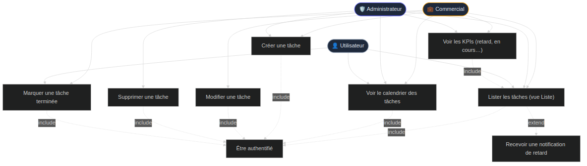

---

### Module Campagnes Email

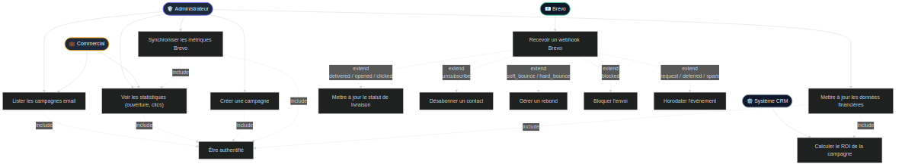

---

### Module Administration

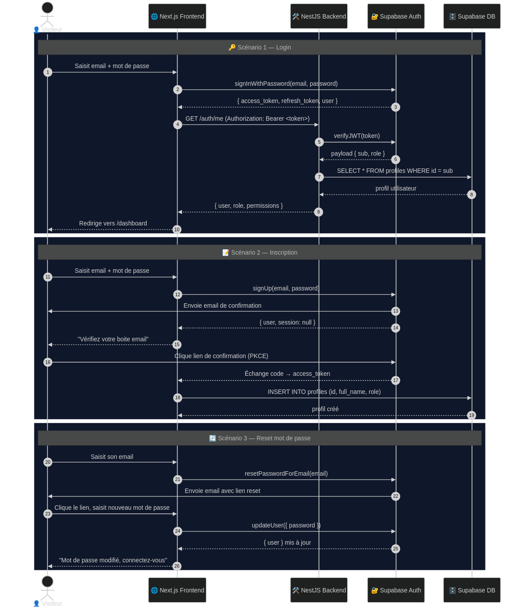

---

## 4. Diagrammes de séquences

---

### Authentification (Login / Register / Reset)

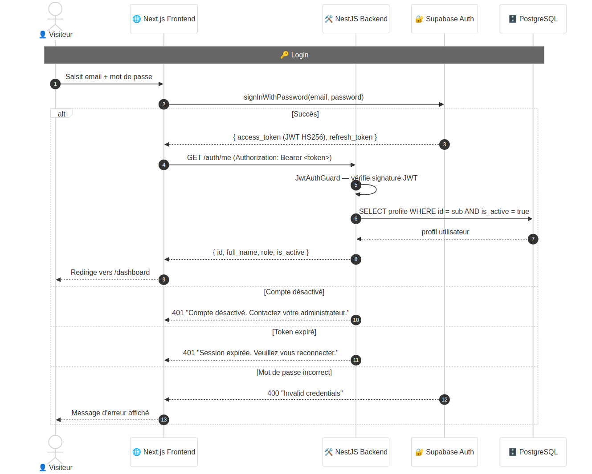

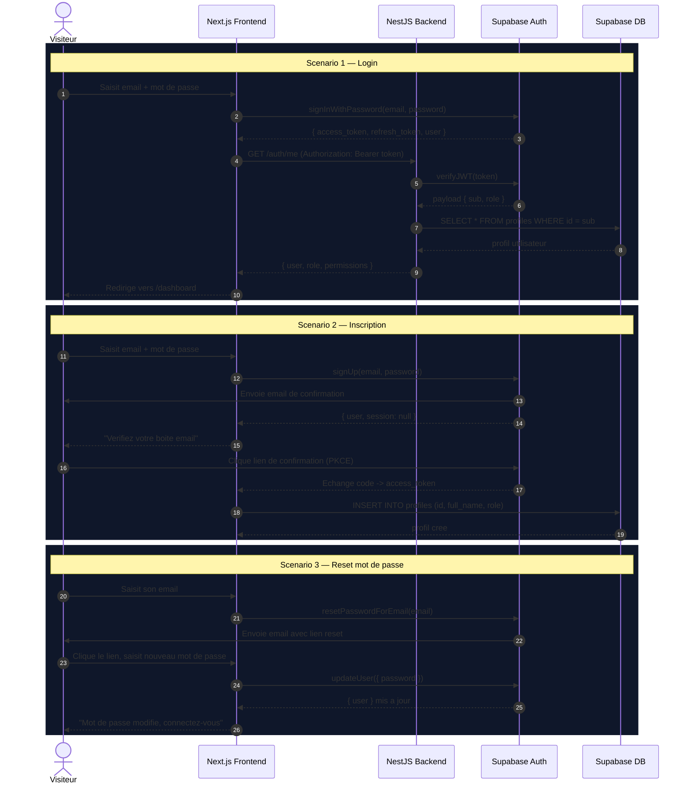
```mermaid
sequenceDiagram
    autonumber
    actor V as Visiteur
    participant FE as Next.js Frontend
    participant BE as NestJS Backend
    participant SA as Supabase Auth
    participant DB as Supabase DB

    rect rgb(15, 23, 42)
        Note over V,DB: Scenario 1 — Login
        V->>FE: Saisit email + mot de passe
        FE->>SA: signInWithPassword(email, password)
        SA-->>FE: { access_token, refresh_token, user }
        FE->>BE: GET /auth/me (Authorization: Bearer token)
        BE->>SA: verifyJWT(token)
        SA-->>BE: payload { sub, role }
        BE->>DB: SELECT * FROM profiles WHERE id = sub
        DB-->>BE: profil utilisateur
        BE-->>FE: { user, role, permissions }
        FE-->>V: Redirige vers /dashboard
    end

    rect rgb(15, 23, 42)
        Note over V,DB: Scenario 2 — Inscription
        V->>FE: Saisit email + mot de passe
        FE->>SA: signUp(email, password)
        SA->>V: Envoie email de confirmation
        SA-->>FE: { user, session: null }
        FE-->>V: "Verifiez votre boite email"
        V->>SA: Clique lien de confirmation (PKCE)
        SA-->>FE: Echange code -> access_token
        FE->>DB: INSERT INTO profiles (id, full_name, role)
        DB-->>FE: profil cree
    end

    rect rgb(15, 23, 42)
        Note over V,DB: Scenario 3 — Reset mot de passe
        V->>FE: Saisit son email
        FE->>SA: resetPasswordForEmail(email)
        SA->>V: Envoie email avec lien reset
        V->>FE: Clique le lien, saisit nouveau mot de passe
        FE->>SA: updateUser({ password })
        SA-->>FE: { user } mis a jour
        FE-->>V: "Mot de passe modifie, connectez-vous"
    end
```

---

### Contacts

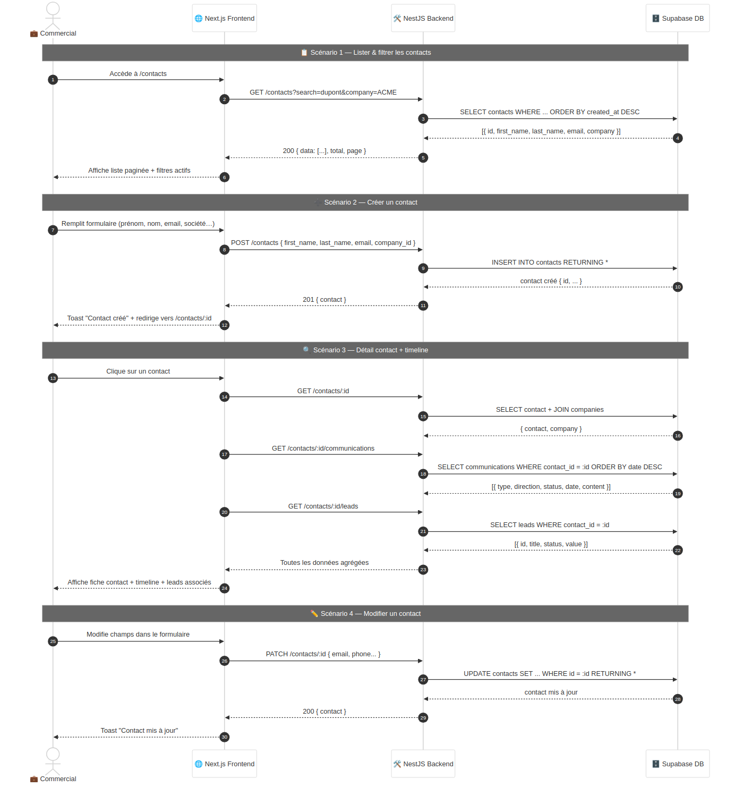

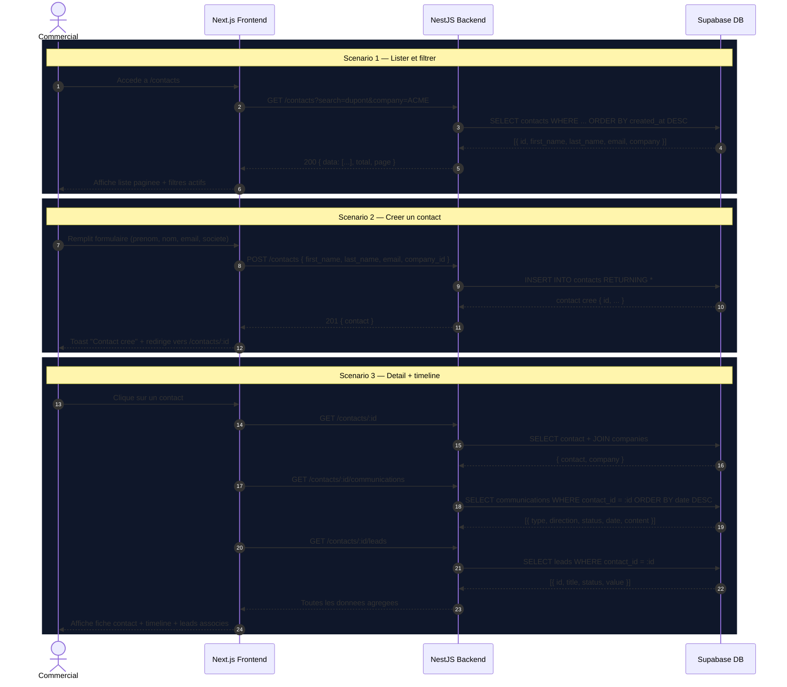
```mermaid
sequenceDiagram
    autonumber
    actor C as Commercial
    participant FE as Next.js Frontend
    participant BE as NestJS Backend
    participant DB as Supabase DB

    rect rgb(15, 23, 42)
        Note over C,DB: Scenario 1 — Lister et filtrer
        C->>FE: Accede a /contacts
        FE->>BE: GET /contacts?search=dupont&company=ACME
        BE->>DB: SELECT contacts WHERE ... ORDER BY created_at DESC
        DB-->>BE: [{ id, first_name, last_name, email, company }]
        BE-->>FE: 200 { data: [...], total, page }
        FE-->>C: Affiche liste paginee + filtres actifs
    end

    rect rgb(15, 23, 42)
        Note over C,DB: Scenario 2 — Creer un contact
        C->>FE: Remplit formulaire (prenom, nom, email, societe)
        FE->>BE: POST /contacts { first_name, last_name, email, company_id }
        BE->>DB: INSERT INTO contacts RETURNING *
        DB-->>BE: contact cree { id, ... }
        BE-->>FE: 201 { contact }
        FE-->>C: Toast "Contact cree" + redirige vers /contacts/:id
    end

    rect rgb(15, 23, 42)
        Note over C,DB: Scenario 3 — Detail + timeline
        C->>FE: Clique sur un contact
        FE->>BE: GET /contacts/:id
        BE->>DB: SELECT contact + JOIN companies
        DB-->>BE: { contact, company }
        FE->>BE: GET /contacts/:id/communications
        BE->>DB: SELECT communications WHERE contact_id = :id ORDER BY date DESC
        DB-->>BE: [{ type, direction, status, date, content }]
        FE->>BE: GET /contacts/:id/leads
        BE->>DB: SELECT leads WHERE contact_id = :id
        DB-->>BE: [{ id, title, status, value }]
        BE-->>FE: Toutes les donnees agregees
        FE-->>C: Affiche fiche contact + timeline + leads associes
    end
```

---

### Entreprises

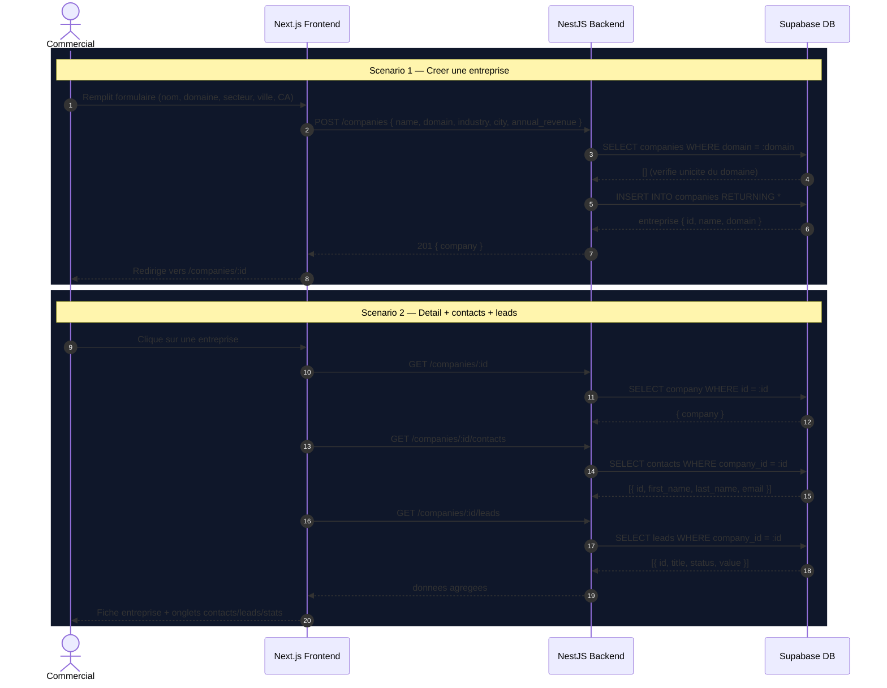
```mermaid
sequenceDiagram
    autonumber
    actor C as Commercial
    participant FE as Next.js Frontend
    participant BE as NestJS Backend
    participant DB as Supabase DB

    rect rgb(15, 23, 42)
        Note over C,DB: Scenario 1 — Creer une entreprise
        C->>FE: Remplit formulaire (nom, domaine, secteur, ville, CA)
        FE->>BE: POST /companies { name, domain, industry, city, annual_revenue }
        BE->>DB: SELECT companies WHERE domain = :domain
        DB-->>BE: [] (verifie unicite du domaine)
        BE->>DB: INSERT INTO companies RETURNING *
        DB-->>BE: entreprise { id, name, domain }
        BE-->>FE: 201 { company }
        FE-->>C: Redirige vers /companies/:id
    end

    rect rgb(15, 23, 42)
        Note over C,DB: Scenario 2 — Detail + contacts + leads
        C->>FE: Clique sur une entreprise
        FE->>BE: GET /companies/:id
        BE->>DB: SELECT company WHERE id = :id
        DB-->>BE: { company }
        FE->>BE: GET /companies/:id/contacts
        BE->>DB: SELECT contacts WHERE company_id = :id
        DB-->>BE: [{ id, first_name, last_name, email }]
        FE->>BE: GET /companies/:id/leads
        BE->>DB: SELECT leads WHERE company_id = :id
        DB-->>BE: [{ id, title, status, value }]
        BE-->>FE: donnees agregees
        FE-->>C: Fiche entreprise + onglets contacts/leads/stats
    end
```

---

### Leads

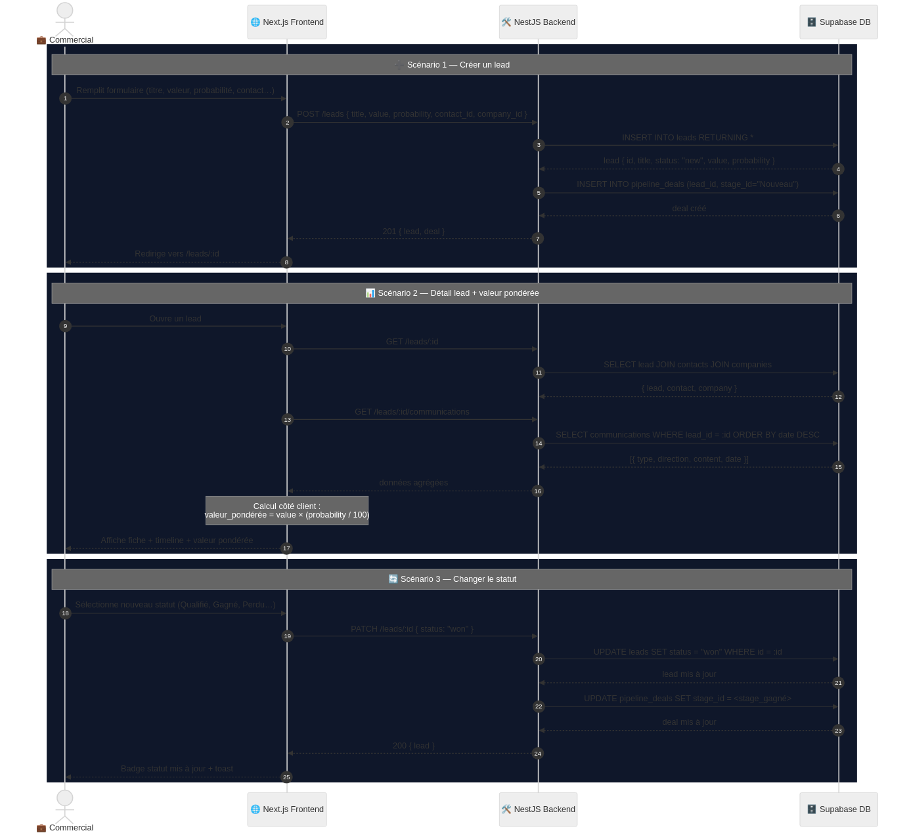

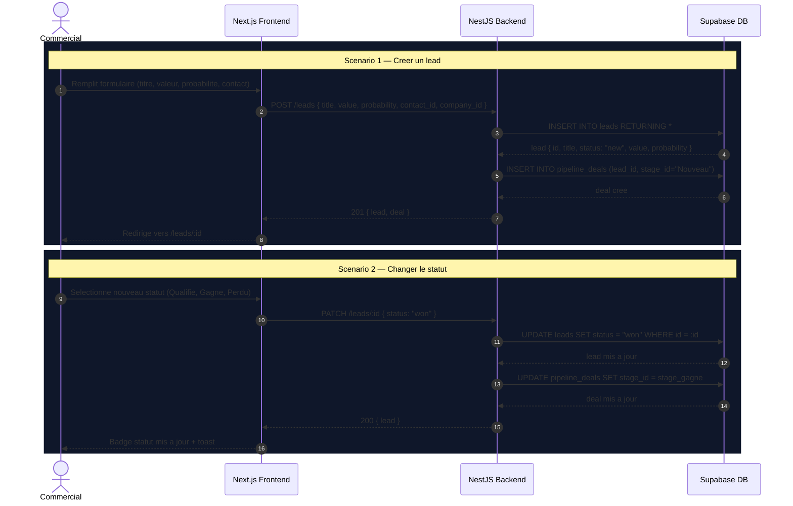
```mermaid
sequenceDiagram
    autonumber
    actor C as Commercial
    participant FE as Next.js Frontend
    participant BE as NestJS Backend
    participant DB as Supabase DB

    rect rgb(15, 23, 42)
        Note over C,DB: Scenario 1 — Creer un lead
        C->>FE: Remplit formulaire (titre, valeur, probabilite, contact)
        FE->>BE: POST /leads { title, value, probability, contact_id, company_id }
        BE->>DB: INSERT INTO leads RETURNING *
        DB-->>BE: lead { id, title, status: "new", value, probability }
        BE->>DB: INSERT INTO pipeline_deals (lead_id, stage_id="Nouveau")
        DB-->>BE: deal cree
        BE-->>FE: 201 { lead, deal }
        FE-->>C: Redirige vers /leads/:id
    end

    rect rgb(15, 23, 42)
        Note over C,DB: Scenario 2 — Changer le statut
        C->>FE: Selectionne nouveau statut (Qualifie, Gagne, Perdu)
        FE->>BE: PATCH /leads/:id { status: "won" }
        BE->>DB: UPDATE leads SET status = "won" WHERE id = :id
        DB-->>BE: lead mis a jour
        BE->>DB: UPDATE pipeline_deals SET stage_id = stage_gagne
        DB-->>BE: deal mis a jour
        BE-->>FE: 200 { lead }
        FE-->>C: Badge statut mis a jour + toast
    end
```

---

### Pipeline Kanban

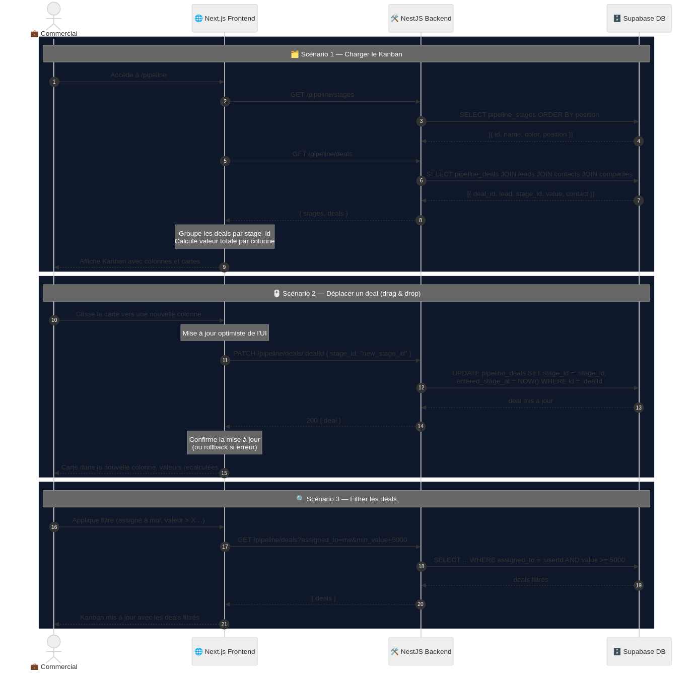

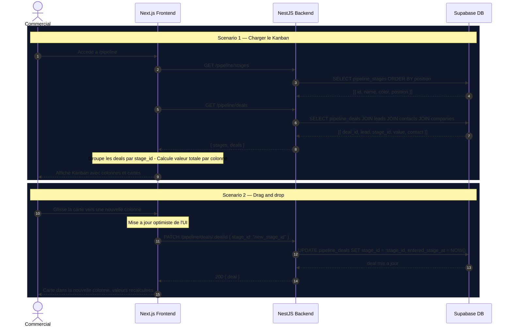
```mermaid
sequenceDiagram
    autonumber
    actor C as Commercial
    participant FE as Next.js Frontend
    participant BE as NestJS Backend
    participant DB as Supabase DB

    rect rgb(15, 23, 42)
        Note over C,DB: Scenario 1 — Charger le Kanban
        C->>FE: Accede a /pipeline
        FE->>BE: GET /pipeline/stages
        BE->>DB: SELECT pipeline_stages ORDER BY position
        DB-->>BE: [{ id, name, color, position }]
        FE->>BE: GET /pipeline/deals
        BE->>DB: SELECT pipeline_deals JOIN leads JOIN contacts JOIN companies
        DB-->>BE: [{ deal_id, lead, stage_id, value, contact }]
        BE-->>FE: { stages, deals }
        Note over FE: Groupe les deals par stage_id - Calcule valeur totale par colonne
        FE-->>C: Affiche Kanban avec colonnes et cartes
    end

    rect rgb(15, 23, 42)
        Note over C,DB: Scenario 2 — Drag and drop
        C->>FE: Glisse la carte vers une nouvelle colonne
        Note over FE: Mise a jour optimiste de l'UI
        FE->>BE: PATCH /pipeline/deals/:dealId { stage_id: "new_stage_id" }
        BE->>DB: UPDATE pipeline_deals SET stage_id = :stage_id, entered_stage_at = NOW()
        DB-->>BE: deal mis a jour
        BE-->>FE: 200 { deal }
        FE-->>C: Carte dans la nouvelle colonne, valeurs recalculees
    end
```

---

### Taches

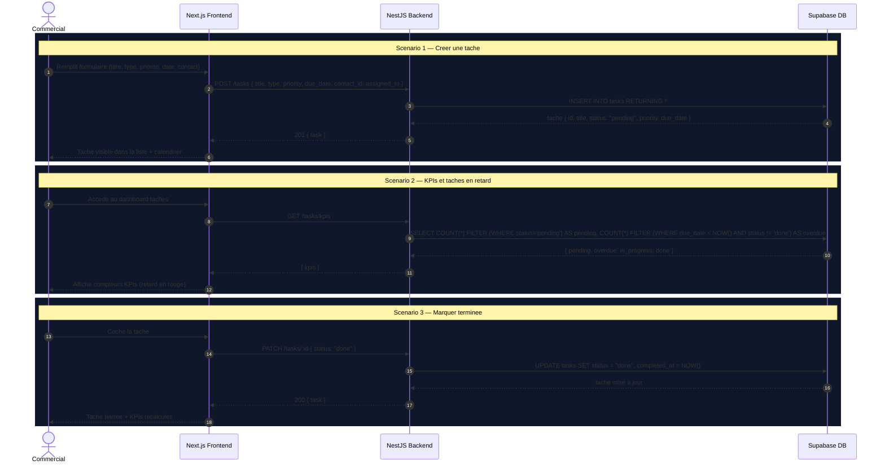
```mermaid
sequenceDiagram
    autonumber
    actor C as Commercial
    participant FE as Next.js Frontend
    participant BE as NestJS Backend
    participant DB as Supabase DB

    rect rgb(15, 23, 42)
        Note over C,DB: Scenario 1 — Creer une tache
        C->>FE: Remplit formulaire (titre, type, priorite, date, contact)
        FE->>BE: POST /tasks { title, type, priority, due_date, contact_id, assigned_to }
        BE->>DB: INSERT INTO tasks RETURNING *
        DB-->>BE: tache { id, title, status: "pending", priority, due_date }
        BE-->>FE: 201 { task }
        FE-->>C: Tache visible dans la liste + calendrier
    end

    rect rgb(15, 23, 42)
        Note over C,DB: Scenario 2 — KPIs et taches en retard
        C->>FE: Accede au dashboard taches
        FE->>BE: GET /tasks/kpis
        BE->>DB: SELECT COUNT(*) FILTER (WHERE status='pending') AS pending, COUNT(*) FILTER (WHERE due_date < NOW() AND status != 'done') AS overdue
        DB-->>BE: { pending, overdue, in_progress, done }
        BE-->>FE: { kpis }
        FE-->>C: Affiche compteurs KPIs (retard en rouge)
    end

    rect rgb(15, 23, 42)
        Note over C,DB: Scenario 3 — Marquer terminee
        C->>FE: Coche la tache
        FE->>BE: PATCH /tasks/:id { status: "done" }
        BE->>DB: UPDATE tasks SET status = "done", completed_at = NOW()
        DB-->>BE: tache mise a jour
        BE-->>FE: 200 { task }
        FE-->>C: Tache barree + KPIs recalcules
    end
```

---

### Campagnes Email (Brevo)

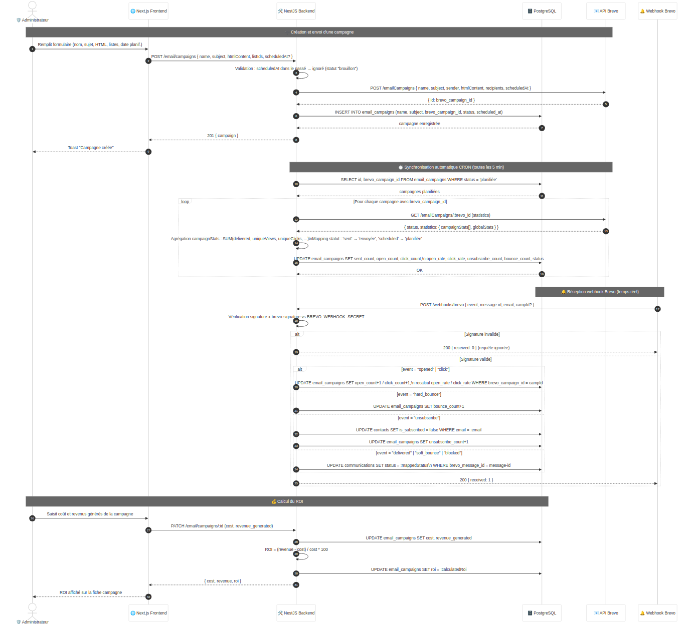

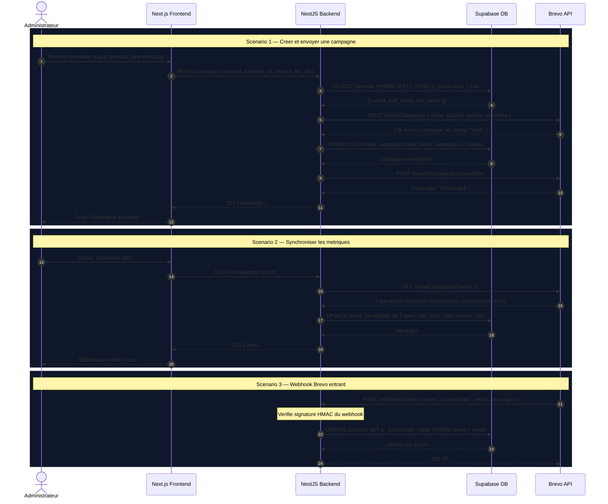
```mermaid
sequenceDiagram
    autonumber
    actor A as Administrateur
    participant FE as Next.js Frontend
    participant BE as NestJS Backend
    participant DB as Supabase DB
    participant BR as Brevo API

    rect rgb(15, 23, 42)
        Note over A,BR: Scenario 1 — Creer et envoyer une campagne
        A->>FE: Remplit formulaire (sujet, template, liste contacts)
        FE->>BE: POST /campaigns { subject, template_id, contact_list_ids }
        BE->>DB: SELECT contacts WHERE id IN (...) AND is_subscribed = true
        DB-->>BE: [{ email, first_name, last_name }]
        BE->>BR: POST /emailCampaigns { name, subject, sender, recipients }
        BR-->>BE: { id: brevo_campaign_id, status: "draft" }
        BE->>DB: INSERT INTO email_campaigns (title, brevo_campaign_id, status)
        DB-->>BE: campagne enregistree
        BE->>BR: POST /emailCampaigns/:id/sendNow
        BR-->>BE: { message: "Scheduled" }
        BE-->>FE: 201 { campaign }
        FE-->>A: Toast "Campagne envoyee"
    end

    rect rgb(15, 23, 42)
        Note over A,BR: Scenario 2 — Synchroniser les metriques
        A->>FE: Clique "Actualiser stats"
        FE->>BE: POST /campaigns/:id/sync
        BE->>BR: GET /emailCampaigns/:brevo_id
        BR-->>BE: { openRate, clickRate, bounceRate, unsubscribeCount }
        BE->>DB: UPDATE email_campaigns SET open_rate, click_rate, bounce_rate
        DB-->>BE: mis a jour
        BE-->>FE: 200 { stats }
        FE-->>A: Statistiques mises a jour
    end

    rect rgb(15, 23, 42)
        Note over A,BR: Scenario 3 — Webhook Brevo entrant
        BR->>BE: POST /webhooks/brevo { event: "unsubscribe", email, messageId }
        Note over BE: Verifie signature HMAC du webhook
        BE->>DB: UPDATE contacts SET is_subscribed = false WHERE email = :email
        DB-->>BE: contact mis a jour
        BE-->>BR: 200 OK
    end
```

---

### Administration

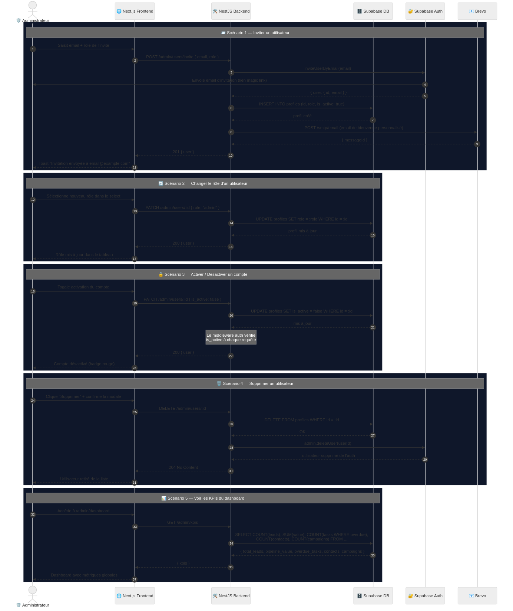

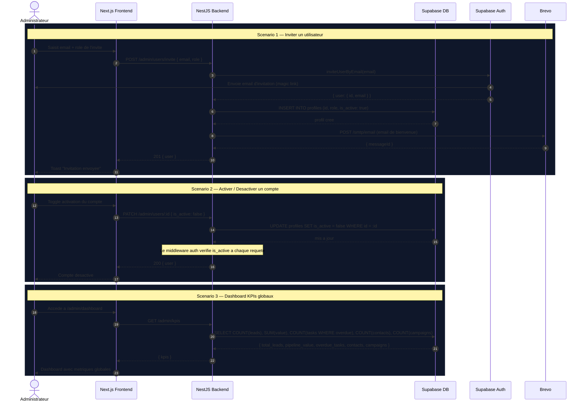
```mermaid
sequenceDiagram
    autonumber
    actor A as Administrateur
    participant FE as Next.js Frontend
    participant BE as NestJS Backend
    participant DB as Supabase DB
    participant SA as Supabase Auth
    participant BR as Brevo

    rect rgb(15, 23, 42)
        Note over A,BR: Scenario 1 — Inviter un utilisateur
        A->>FE: Saisit email + role de l'invite
        FE->>BE: POST /admin/users/invite { email, role }
        BE->>SA: inviteUserByEmail(email)
        SA->>A: Envoie email d'invitation (magic link)
        SA-->>BE: { user: { id, email } }
        BE->>DB: INSERT INTO profiles (id, role, is_active: true)
        DB-->>BE: profil cree
        BE->>BR: POST /smtp/email (email de bienvenue)
        BR-->>BE: { messageId }
        BE-->>FE: 201 { user }
        FE-->>A: Toast "Invitation envoyee"
    end

    rect rgb(15, 23, 42)
        Note over A,DB: Scenario 2 — Activer / Desactiver un compte
        A->>FE: Toggle activation du compte
        FE->>BE: PATCH /admin/users/:id { is_active: false }
        BE->>DB: UPDATE profiles SET is_active = false WHERE id = :id
        DB-->>BE: mis a jour
        Note over BE: Le middleware auth verifie is_active a chaque requete
        BE-->>FE: 200 { user }
        FE-->>A: Compte desactive
    end

    rect rgb(15, 23, 42)
        Note over A,DB: Scenario 3 — Dashboard KPIs globaux
        A->>FE: Accede a /admin/dashboard
        FE->>BE: GET /admin/kpis
        BE->>DB: SELECT COUNT(leads), SUM(value), COUNT(tasks WHERE overdue), COUNT(contacts), COUNT(campaigns)
        DB-->>BE: { total_leads, pipeline_value, overdue_tasks, contacts, campaigns }
        BE-->>FE: { kpis }
        FE-->>A: Dashboard avec metriques globales
    end
```

---

## 5. Référentiel des endpoints API

### Auth

| Methode | Endpoint | Description | Roles |
|---------|----------|-------------|-------|
| `GET` | `/auth/me` | Profil utilisateur courant | Tous |
| `POST` | `/auth/logout` | Deconnexion | Tous |

### Contacts

| Methode | Endpoint | Description | Roles |
|---------|----------|-------------|-------|
| `GET` | `/contacts` | Lister (filtres : search, company, page) | Commercial, Admin |
| `POST` | `/contacts` | Creer un contact | Commercial, Admin |
| `GET` | `/contacts/:id` | Detail contact | Commercial, Admin |
| `PATCH` | `/contacts/:id` | Modifier un contact | Commercial, Admin |
| `DELETE` | `/contacts/:id` | Supprimer un contact | Admin |
| `GET` | `/contacts/:id/communications` | Timeline des interactions | Commercial, Admin |
| `GET` | `/contacts/:id/leads` | Leads associes | Commercial, Admin |

### Entreprises

| Methode | Endpoint | Description | Roles |
|---------|----------|-------------|-------|
| `GET` | `/companies` | Lister (filtres : industry, city) | Commercial, Admin |
| `POST` | `/companies` | Creer une entreprise | Commercial, Admin |
| `GET` | `/companies/:id` | Detail entreprise | Commercial, Admin |
| `PATCH` | `/companies/:id` | Modifier une entreprise | Commercial, Admin |
| `DELETE` | `/companies/:id` | Supprimer une entreprise | Admin |
| `GET` | `/companies/:id/contacts` | Contacts lies | Commercial, Admin |
| `GET` | `/companies/:id/leads` | Leads lies | Commercial, Admin |

### Leads

| Methode | Endpoint | Description | Roles |
|---------|----------|-------------|-------|
| `GET` | `/leads` | Lister les leads | Commercial (les siens), Admin (tous) |
| `POST` | `/leads` | Creer un lead (+ deal pipeline) | Commercial, Admin |
| `GET` | `/leads/:id` | Detail lead | Commercial, Admin |
| `PATCH` | `/leads/:id` | Modifier statut / valeur | Commercial, Admin |
| `DELETE` | `/leads/:id` | Supprimer un lead | Admin |
| `GET` | `/leads/:id/communications` | Timeline communications | Commercial, Admin |

### Pipeline

| Methode | Endpoint | Description | Roles |
|---------|----------|-------------|-------|
| `GET` | `/pipeline/stages` | Etapes du Kanban | Commercial, Admin |
| `GET` | `/pipeline/deals` | Deals par etape | Commercial, Admin |
| `PATCH` | `/pipeline/deals/:id` | Deplacer un deal | Commercial, Admin |

### Taches

| Methode | Endpoint | Description | Roles |
|---------|----------|-------------|-------|
| `GET` | `/tasks` | Lister les taches (filtres : view, month, assigned_to) | Tous |
| `POST` | `/tasks` | Creer une tache | Commercial, Admin |
| `PATCH` | `/tasks/:id` | Modifier / marquer terminee | Commercial, Admin |
| `DELETE` | `/tasks/:id` | Supprimer une tache | Admin |
| `GET` | `/tasks/kpis` | KPIs (en retard, en cours, terminees) | Tous |

### Campagnes

| Methode | Endpoint | Description | Roles |
|---------|----------|-------------|-------|
| `GET` | `/campaigns` | Lister les campagnes | Commercial, Admin |
| `POST` | `/campaigns` | Creer et envoyer une campagne | Admin |
| `GET` | `/campaigns/:id` | Detail + statistiques | Commercial, Admin |
| `POST` | `/campaigns/:id/sync` | Synchroniser stats Brevo | Admin |
| `POST` | `/webhooks/brevo` | Reception webhooks Brevo | Systeme |

### Administration

| Methode | Endpoint | Description | Roles |
|---------|----------|-------------|-------|
| `GET` | `/admin/users` | Lister les utilisateurs | Admin |
| `POST` | `/admin/users/invite` | Inviter un utilisateur | Admin |
| `PATCH` | `/admin/users/:id` | Modifier role / activation | Admin |
| `DELETE` | `/admin/users/:id` | Supprimer un utilisateur | Admin |
| `GET` | `/admin/kpis` | KPIs globaux du dashboard | Admin |

### Dashboard

| Methode | Endpoint | Description | Roles |
|---------|----------|-------------|-------|
| `GET` | `/dashboard/kpis` | Metriques agregees (CA, conversion, pipeline…) | Commercial, Admin |
| `GET` | `/dashboard/activity` | Flux d'activite recent | Commercial, Admin |