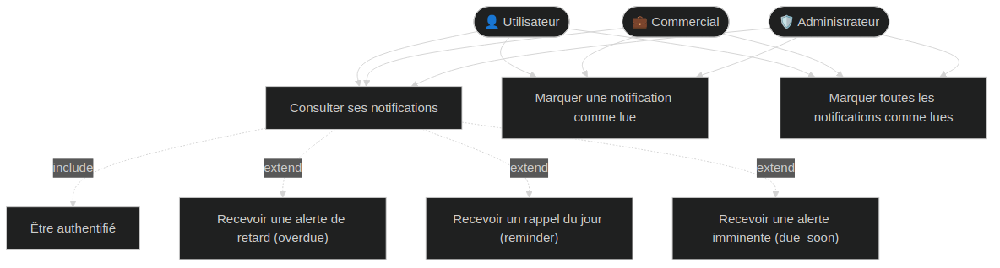
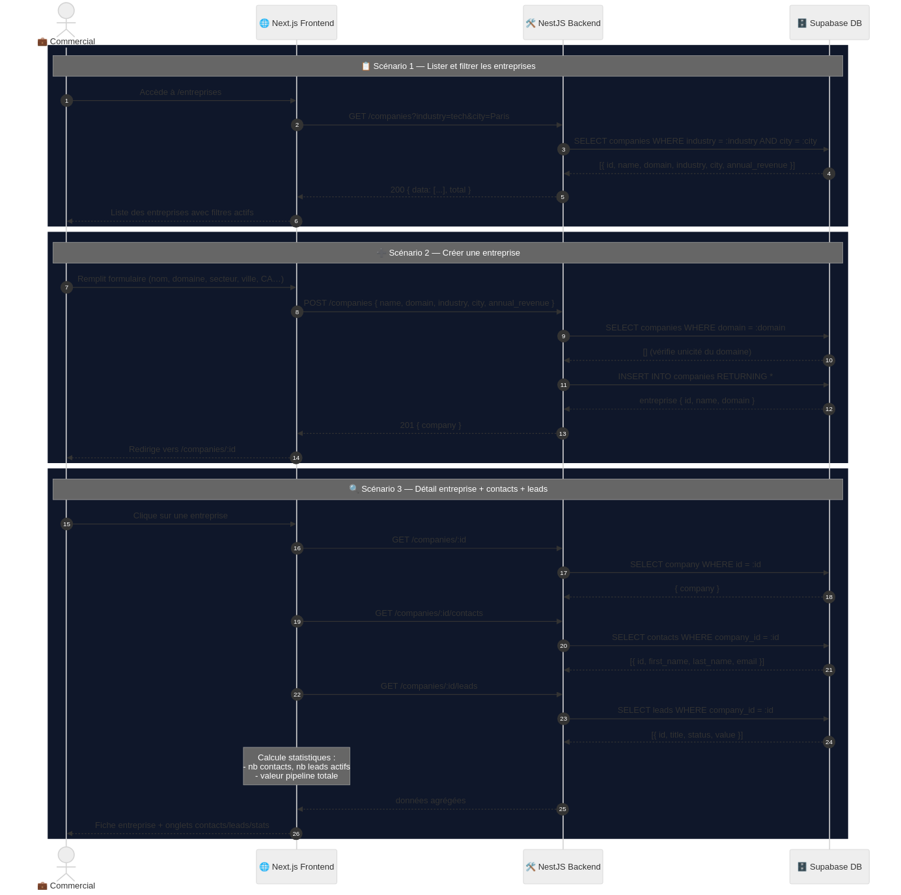
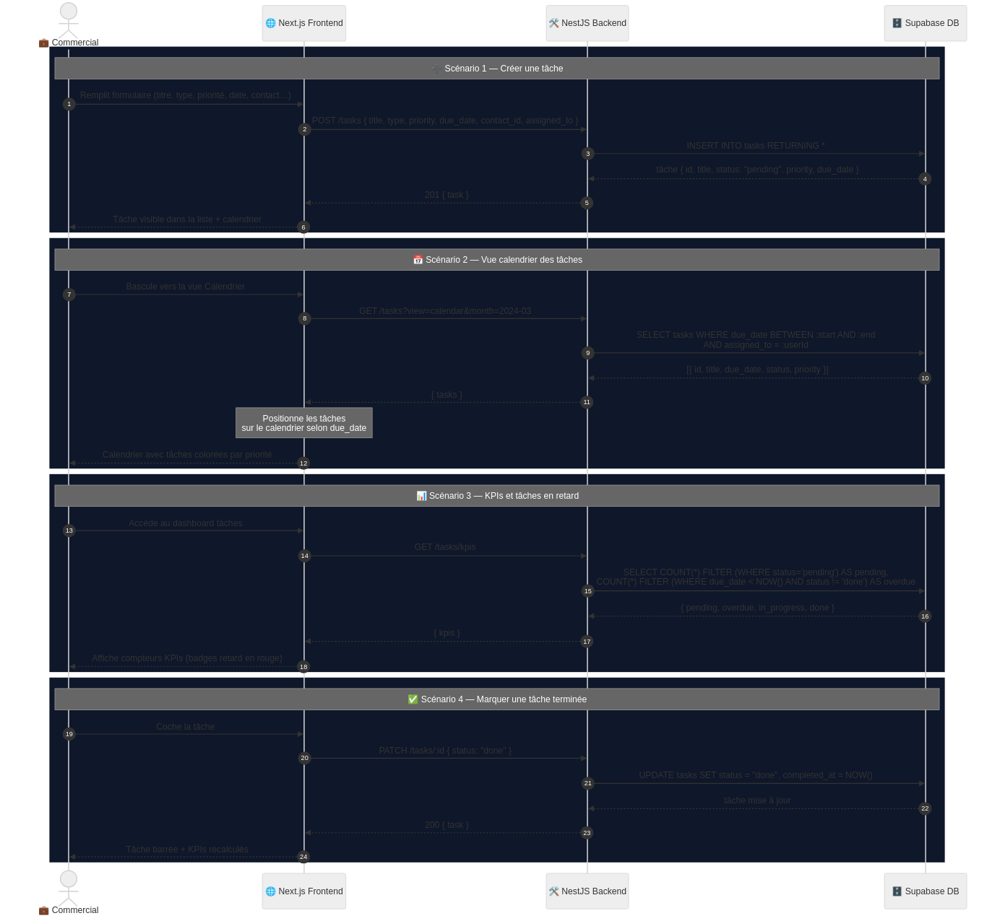

# Documentation technique — CRM Pro

> Ce document centralise l'ensemble des éléments techniques du projet : analyse des besoins, modèle de données, cas d'utilisation, séquences d'interactions, description des fonctionnalités et référentiel API.

---

## Table des matières

1. [Analyse des Besoins](#1-analyse-des-besoins)
2. [Modèle de données (MCD)](#2-modèle-de-données-mcd)
3. [Acteurs et rôles](#3-acteurs-et-rôles)
4. [Cas d'utilisation (UML)](#4-cas-dutilisation-uml)
5. [Diagrammes de séquences](#5-diagrammes-de-séquences)
6. [Description des fonctionnalités](#6-description-des-fonctionnalités)
7. [Référentiel des endpoints API](#7-référentiel-des-endpoints-api)

---

## 1. Analyse des Besoins

### 1.1 Objectifs du Projet

CRM Pro est une application de gestion de la relation client (Customer Relationship Management) destinée aux équipes commerciales de taille moyenne. Le projet vise à centraliser, automatiser et optimiser les interactions entre une organisation et ses prospects ou clients. Les trois axes stratégiques sont les suivants.

**Gestion opérationnelle des relations clients.** Le CRM consolide dans un référentiel unique l'ensemble des données relatives aux entreprises, aux contacts, aux opportunités commerciales et aux communications. Cette centralisation élimine la fragmentation de l'information entre des outils hétérogènes et garantit une vision partagée et cohérente de chaque relation client.

**Suivi du pipeline de vente.** Le module Pipeline matérialise le cycle de vie d'une opportunité commerciale sous la forme d'un tableau Kanban organisé en étapes séquentielles (prospect, qualification, proposition, négociation, gagné, perdu). Chaque déplacement d'un deal entre les étapes est traçable, horodaté et peut déclencher des notifications automatiques.

**Automatisation marketing via Brevo.** L'intégration avec la plateforme Brevo (anciennement Sendinblue) permet de créer, planifier et envoyer des campagnes d'emailing depuis l'interface du CRM, de recevoir les événements de livraison en temps réel via des webhooks, et de déclencher des emails transactionnels automatiques lors des événements métier clés (création d'un lead, changement de statut, assignation d'une tâche).

### 1.2 Besoins Fonctionnels par Profil

Le système distingue quatre acteurs principaux aux périmètres d'accès différenciés.

**Administrateur.** Accès complet à l'ensemble des modules. Ses besoins spécifiques concernent la gestion des utilisateurs : inviter de nouveaux membres, attribuer ou modifier les rôles, activer/désactiver des comptes, supprimer des profils. Il consulte les indicateurs de performance globaux couvrant l'intégralité des données du CRM. Il est le seul acteur autorisé à créer et envoyer des campagnes d'emailing.

**Commercial.** Opère sur le périmètre de ses propres données. Il crée et gère les contacts, entreprises et leads qui lui sont assignés, fait avancer ses opportunités dans le pipeline Kanban, gère ses tâches et consulte les campagnes email en lecture seule. Ses indicateurs de performance sont filtrés automatiquement sur son périmètre d'assignation.

**Utilisateur.** Accès en lecture seule sur les contacts et gestion de ses propres tâches. N'a pas accès au module des leads ni au pipeline de vente. Ce rôle correspond typiquement à un collaborateur en soutien commercial dont les droits d'édition doivent être limités.

### 1.3 Enjeux de la Centralisation des Données

**Unicité du référentiel.** Chaque entité (entreprise, contact, opportunité) possède un identifiant unique (UUID). Les relations entre entités sont matérialisées par des clés étrangères, garantissant l'intégrité référentielle et évitant les doublons.

**Traçabilité des interactions.** Chaque communication (appel, email, réunion, note, SMS) est enregistrée dans la table `communications` avec son horodatage, son auteur, sa direction (entrant/sortant) et son statut de livraison, permettant de reconstituer l'historique complet d'une relation client.

**Contrôle d'accès granulaire.** Le modèle RBAC (Role-Based Access Control) garantit que chaque utilisateur n'accède qu'aux données relevant de son périmètre. Les commerciaux sont isolés les uns des autres via le champ `assigned_to`.

**Cohérence analytique.** Le rattachement systématique des leads, tâches et communications à des profils utilisateurs identifiés permet de calculer des indicateurs de performance (taux de conversion, CA par commercial, pipeline pondéré) fiables et auditables.

---

## 2. Modèle de données (MCD)

### Légende

| Sigle | Type | Description |
|-------|------|-------------|
| **PK** | Primary Key | Identifiant unique (UUID) généré par `uuid_generate_v4()` |
| **FK** | Foreign Key | Relation vers une autre table (contrainte d'intégrité) |
| **UK** | Unique Key | Valeur unique obligatoire (ex : email, domaine) |
| `Non_Nullable` | Obligatoire | Champ `NOT NULL` requis pour la validation |
| `Nullable` | Optionnel | Champ pouvant être nul en base de données |

### Relations structurantes

**Companies ↔ Contacts.** Une `company` peut avoir plusieurs `contacts`. Un contact appartient à une seule entreprise. La clé étrangère `company_id` est définie avec `ON DELETE SET NULL`, préservant les contacts si l'entreprise est supprimée.

**Contacts ↔ Leads.** Un `contact` génère des `leads` (opportunités commerciales). Un lead est lié à la fois à un contact et à une entreprise.

**Leads ↔ Pipeline.** Un `lead` est transformé en `deal` dans le pipeline de vente. La table `pipeline_deals` matérialise cette transformation en associant un lead à une étape (`pipeline_stages`). L'horodatage `entered_stage_at` permet de mesurer le temps passé à chaque étape et de calculer la durée du cycle de vente.

**Tasks et Communications (rattachement multiple).** Les `tasks` et `communications` peuvent être rattachées simultanément à un contact, un lead et une entreprise via trois clés étrangères nullable, permettant un historique complet de l'activité commerciale autour d'une opportunité.

**Corrélation Brevo.** Le champ `brevo_message_id` sur la table `communications` permet de corréler les enregistrements locaux avec les événements de livraison reçus via les webhooks Brevo, assurant le suivi du statut de chaque email transactionnel (livré, ouvert, cliqué, rebondi).

---

## 3. Acteurs et rôles

| Acteur | Rôle DB | Périmètre d'accès |
|--------|---------|-------------------|
| **Visiteur** | — | Pages publiques uniquement (login, register, reset) |
| **Utilisateur** | `utilisateur` | Lecture contacts, tâches personnelles |
| **Commercial** | `commercial` | CRUD contacts, entreprises, leads, pipeline, tâches — lecture stats campagnes |
| **Administrateur** | `admin` | Accès complet + gestion utilisateurs + KPIs globaux |
| **Supabase Auth** | Système externe | Authentification, émission JWT, emails système |
| **Brevo** | Système externe | Envoi campagnes, webhooks entrants (événements email) |

### Matrice des permissions par module

| Fonctionnalité | Admin | Commercial | Utilisateur |
|----------------|-------|------------|-------------|
| Voir tous les leads | Oui | Non (seulement les siens) | Non |
| Créer des leads / contacts | Oui | Oui | Non |
| Accéder aux paramètres | Oui | Non | Non |
| Créer des utilisateurs | Oui | Non | Non |
| Gérer ses tâches | Oui | Oui | Oui |
| Voir les campagnes | Oui | Oui (lecture) | Non |
| Créer des campagnes | Oui | Non | Non |
| Voir les notifications | Oui | Oui | Oui |
| Consulter le dashboard KPIs | Oui (global) | Oui (périmètre) | Non |

---

## 4. Cas d'utilisation (UML)

### 4.1 Vue de synthèse — Tous les modules

---

### 4.2 Module Accès (Authentification)

**Lacune identifiée et correction :** Les diagrammes originaux ne modélisaient pas les scénarios d'échec. Il est recommandé d'ajouter un cas d'utilisation `Gérer l'erreur d'authentification` en **extension** des cas `Se connecter` et `Vérifier JWT / Session`, avec des spécialisations pour les sous-types d'erreurs suivants :

- `Token JWT expiré` → message "Session expirée. Veuillez vous reconnecter."
- `Token absent` → message "Authentification requise."
- `Token invalide` → message "Token invalide ou expiré."
- `Compte désactivé` → message "Compte désactivé. Contactez votre administrateur." (vérifié via `is_active = false` dans `JwtStrategy.validate()`)

Ces distinctions sont déjà implémentées dans `JwtAuthGuard` et `JwtStrategy` ; la modélisation UML doit les refléter.

---

### 4.3 Module Contacts

---

### 4.4 Module Entreprises

---

### 4.5 Module Leads

---

### 4.6 Module Pipeline (Kanban)

---

### 4.7 Module Tâches

---

### 4.8 Module Campagnes Email

**Lacune identifiée et correction :** Le cas d'utilisation `Recevoir un webhook Brevo` est présenté comme un cas unique. Il doit être décomposé en cas **étendus** selon le type d'événement, conformément à l'implémentation effective de `WebhooksController` :

| Événement Brevo | Cas d'utilisation étendu |
|-----------------|--------------------------|
| `delivered`, `opened`, `clicked` | `Mettre à jour le statut de livraison` |
| `soft_bounce`, `hard_bounce` | `Gérer un rebond` (+ stockage `delivery_error`) |
| `unsubscribe` | `Désabonner un contact` (mise à jour `is_subscribed = false`) |
| `blocked` | `Bloquer l'envoi` (+ stockage `delivery_error`) |
| `request`, `deferred`, `spam` | `Horodater l'événement` (mise à jour `updated_at`) |

**Lacune supplémentaire :** Le calcul du ROI (méthode `calculateAndSaveRoi()`) déclenché automatiquement lors de la mise à jour des données financières d'une campagne devrait être modélisé comme un acteur système secondaire (`Système CRM`) interagissant avec un cas d'utilisation `Calculer le ROI de la campagne`.

---

### 4.9 Module Notifications 

---

### 4.10 Module Administration

---

## 5. Diagrammes de séquences

### 5.1 Authentification (Login / Register / Reset)

---

### 5.2 Contacts

---

### 5.3 Entreprises

---

### 5.4 Leads

---

### 5.5 Pipeline Kanban

---

### 5.6 Cycle de vie d'une tâche 

---

### 5.7 Campagnes Email — Brevo 

---

### 5.8 Administration

---

## 6. Description des fonctionnalités

### 6.1 Gestion des Contacts

Le module Contacts constitue le cœur du référentiel client. Il permet de créer, consulter, modifier et supprimer des fiches contacts avec les informations suivantes : identité (prénom, nom, email, téléphone, mobile), localisation (adresse, ville, pays), profil professionnel (intitulé de poste, département, URL LinkedIn), et statut de consentement marketing (`is_subscribed`).

Chaque contact peut être rattaché à une entreprise (`company_id`) et assigné à un commercial (`assigned_to`). Un contact sans assignation est visible par tous les commerciaux, ce qui permet la prise en charge des leads entrants non attribués.

**Actions automatiques à la création.** Lorsqu'un contact est créé avec une adresse email renseignée, le service déclenche automatiquement deux actions asynchrones (fire-and-forget, sans bloquer la réponse HTTP) :
- Envoi d'un email de bienvenue via le template `WELCOME`
- Ajout du contact à la liste Brevo configurée (`BREVO_LIST_ID`) si `is_subscribed = true`

**Filtrage et pagination.** La liste des contacts supporte une pagination (`page`/`limit`) et un filtrage multi-critères : recherche textuelle sur le prénom, le nom, l'email et l'intitulé de poste (`ILIKE` PostgreSQL), filtre par entreprise, par responsable, par statut d'abonnement et par ville.

**Contrôle d'accès.** Les commerciaux voient leurs contacts assignés et les contacts non assignés. Les administrateurs voient l'ensemble des contacts.

### 6.2 Gestion des Entreprises

Le module Entreprises gère le référentiel des organisations clientes ou prospects. Chaque fiche entreprise comprend les informations d'identification (nom, domaine web — unique en base, secteur d'activité, taille), les coordonnées (téléphone, adresse, ville, pays), et les données financières (chiffre d'affaires annuel, logo).

La vue de détail d'une entreprise consolide en une seule requête les informations de l'entreprise et la liste de ses contacts associés (jusqu'à 50 contacts). Cette agrégation évite les requêtes multiples depuis le frontend.

**Statistiques disponibles via `GET /companies/stats` :**
- Nombre total d'entreprises
- Nombre de nouvelles entreprises dans le mois courant
- Répartition par secteur d'activité (top 5, calculée par requête SQL directe)

### 6.3 Pipeline de Vente (Module Kanban)

Le module Pipeline matérialise la progression des opportunités commerciales sous la forme d'un tableau Kanban.

**Structure du Kanban.** Le Kanban est organisé en étapes configurables (`pipeline_stages`), chacune caractérisée par un nom, un code d'étape normalisé (`prospect`, `qualification`, `proposition`, `négociation`, `gagné`, `perdu`), un indice d'ordre et une couleur. Chaque colonne affiche les deals associés, enrichis des informations du lead, du contact, de l'entreprise et du responsable via des jointures `LEFT JOIN`. La valeur totale de chaque colonne est calculée côté serveur.

**Déplacement des deals et synchronisation des statuts.** Le déplacement d'un deal (`PATCH /pipeline/deals/:id/move`) met à jour simultanément deux tables :
- `pipeline_deals` : nouvel `stage_id`, horodatage `entered_stage_at`
- `leads` : mise à jour du statut selon la correspondance étape/statut (`stageToStatus`)

Cette synchronisation bidirectionnelle garantit la cohérence entre la vue liste des leads et la vue Kanban.

Tout déplacement vers une étape significative (qualifié, proposition, négociation, gagné, perdu) déclenche un email de notification asynchrone à l'assigné du lead via `EmailService.sendDealStageChanged`.

**Statistiques du pipeline** (`GET /pipeline/stats`) :
- Nombre de deals, valeur totale et probabilité moyenne par étape
- Indicateur synthétique de **revenu pondéré** : somme des valeurs × probabilités de conversion, exprimée en euros (estimateur statistique du CA attendu)

### 6.4 Suivi des Tâches

Le module Tâches gère l'ensemble des activités planifiées des commerciaux : tâches ordinaires, rappels, rendez-vous et appels. Il est conçu pour alimenter à la fois une vue liste filtrable et une vue calendrier.

**Création et assignation.** Une tâche est définie par son titre, son type (`tache`, `rappel`, `rendez-vous`, `appel`), sa priorité (`basse`, `moyenne`, `haute`, `urgente`), sa date d'échéance et ses relations optionnelles avec un contact, un lead et une entreprise. Lorsqu'une tâche est assignée à un autre commercial que le créateur, un email de notification est envoyé au responsable désigné.

**Validation.** Le `ValidationPipe` de NestJS rejette toute date d'échéance passée via le décorateur `@MinDate()`.

**Filtrage et vues.** La liste supporte les filtres : statut, priorité, type, responsable, contact/lead associé, indicateur de retard (`overdue`), plage de dates (`date_from`/`date_to` pour la vue calendrier). Les tâches sont triées par priorité décroissante puis par date d'échéance.

**Cycle de vie.** Les statuts possibles sont `à_faire` → `en_cours` → `terminée` / `annulée`. Lors du passage au statut `terminée`, le champ `completed_at` est renseigné automatiquement si absent du DTO.

**Notifications en temps réel.** Le module Notifications calcule à la volée, sans table dédiée, trois types d'alertes depuis les tâches de l'utilisateur :
- `overdue` : échéance dépassée, statut actif
- `reminder` : tâche due aujourd'hui
- `due_soon` : tâche due dans les 24 prochaines heures

Chaque notification possède un identifiant déterministe `taskId-type`, permettant un marquage "lu" idempotent. L'état de lecture est conservé en mémoire serveur par session (réinitialisé au redémarrage).

### 6.5 Campagnes d'Emailing

Le module Email centralise la gestion des communications marketing en masse et des emails transactionnels déclencheurs d'événements métier.

**Campagnes marketing.** L'administrateur peut créer une campagne en saisissant le nom, le sujet, le contenu HTML et les identifiants des listes de destinataires Brevo. Une date de planification optionnelle permet de différer l'envoi. La campagne est créée simultanément dans Brevo (qui retourne un `brevo_campaign_id`) et en base de données locale.

Les statistiques sont disponibles en lecture (taux d'ouverture, taux de clics, nombre de rebonds, désabonnements, conversions) et peuvent être synchronisées manuellement (`PATCH /email/campaigns/:id/sync`) ou automatiquement par le job CRON (toutes les 5 minutes pour les campagnes en statut `planifiée`).

**Calcul du ROI.** Le module calcule le retour sur investissement de chaque campagne : `ROI = (revenus générés - coût) / coût × 100`. Les données financières sont saisies manuellement par l'administrateur et le ROI est mis en cache dans la colonne `roi` de la table `email_campaigns`.

**Emails transactionnels.** Huit templates HTML sont définis localement dans `templates.config.ts` et rendus par Resend. La chaîne de délivrance utilise trois niveaux de fallback : API Brevo transactionnelle → Resend → SMTP Brevo. Chaque envoi réussi est journalisé dans la table `communications` avec le `messageId`, permettant le suivi du statut via les webhooks entrants.

| Template | Déclencheur |
|----------|-------------|
| `WELCOME` | Création d'un contact avec email |
| `LEAD_ASSIGNED` | Création d'un lead avec assignation |
| `DEAL_STAGE_CHANGED` | Déplacement d'un deal dans le pipeline |
| `LEAD_WON` | Deal passé au statut "gagné" |
| `LEAD_LOST` | Deal passé au statut "perdu" |
| `TASK_ASSIGNED` | Tâche assignée à un autre utilisateur |
| `TASK_DUE_SOON` | Tâche dont l'échéance approche |
| `RESET_PASSWORD` | Demande de réinitialisation de mot de passe |

### 6.6 Indicateurs de Performance (KPIs) par Rôle

Tous les KPIs supportent un filtre de période paramétré (`startDate` / `endDate`) permettant de comparer les performances sur des plages personnalisées (mois, trimestre, année). En l'absence de paramètres, la période par défaut est le mois courant. Le service calcule également les valeurs de la période précédente (durée équivalente) pour permettre le calcul de tendances côté frontend.

| Indicateur | Périmètre Commercial | Périmètre Admin |
|------------|----------------------|-----------------|
| Chiffre d'affaires (période) | Leads gagnés assignés au commercial | Tous les leads gagnés |
| Taux de conversion | Leads du commercial (période) | Tous les leads (période) |
| Pipeline total | Leads actifs du commercial (hors gagné/perdu) | Ensemble du pipeline |
| Tâches en retard | Tâches assignées au commercial | Tâches assignées au commercial |
| Tâches urgentes | Priorité haute/urgente du commercial | Tâches du commercial |
| Nouveaux contacts | Contacts assignés au commercial (période) | Tous les contacts (période) |
| Total contacts | Contacts assignés au commercial | Tous les contacts |
| RDV du jour | Tâches type `rendez-vous` du commercial | Tâches du commercial |
| Leads par statut | Leads du commercial par statut | Tous les leads par statut |
| Leads par source | Leads du commercial par canal | Tous les leads par canal |
| Lifetime Value (LTV) | Contacts assignés au commercial | Tous les contacts |
| Top commerciaux | Non disponible | Classement par CA (période) |
| Segmentation contacts | Contacts assignés (par secteur/ville) | Tous les contacts (par secteur/ville) |

---

## 7. Référentiel des endpoints API

### Auth

| Méthode | Endpoint | Description | Rôles |
|---------|----------|-------------|-------|
| `GET` | `/auth/me` | Profil utilisateur courant | Tous |
| `PATCH` | `/auth/me` | Mettre à jour son profil | Tous |
| `POST` | `/auth/logout` | Déconnexion | Tous |
| `GET` | `/auth/users` | Lister les utilisateurs | Admin |
| `POST` | `/auth/invite` | Inviter un utilisateur | Admin |
| `PATCH` | `/auth/users/:id/role` | Modifier le rôle | Admin |
| `PATCH` | `/auth/users/:id/active` | Activer/désactiver un compte | Admin |
| `DELETE` | `/auth/users/:id` | Supprimer un utilisateur | Admin |

### Contacts

| Méthode | Endpoint | Description | Rôles |
|---------|----------|-------------|-------|
| `GET` | `/contacts` | Lister (filtres : search, company, is_subscribed, page) | Commercial, Admin |
| `POST` | `/contacts` | Créer un contact | Commercial, Admin |
| `GET` | `/contacts/stats` | Statistiques contacts | Commercial, Admin |
| `GET` | `/contacts/:id` | Détail contact | Commercial, Admin |
| `PATCH` | `/contacts/:id` | Modifier un contact | Commercial, Admin |
| `DELETE` | `/contacts/:id` | Supprimer un contact | Admin |
| `GET` | `/contacts/:id/communications` | Timeline des interactions | Commercial, Admin |
| `GET` | `/contacts/:id/leads` | Leads associés | Commercial, Admin |

### Entreprises

| Méthode | Endpoint | Description | Rôles |
|---------|----------|-------------|-------|
| `GET` | `/companies` | Lister (filtres : industry, city) | Commercial, Admin |
| `POST` | `/companies` | Créer une entreprise | Commercial, Admin |
| `GET` | `/companies/stats` | Statistiques entreprises | Commercial, Admin |
| `GET` | `/companies/:id` | Détail entreprise + contacts | Commercial, Admin |
| `PATCH` | `/companies/:id` | Modifier une entreprise | Commercial, Admin |
| `DELETE` | `/companies/:id` | Supprimer une entreprise | Admin |
| `GET` | `/companies/:id/contacts` | Contacts liés | Commercial, Admin |
| `GET` | `/companies/:id/leads` | Leads liés | Commercial, Admin |

### Leads

| Méthode | Endpoint | Description | Rôles |
|---------|----------|-------------|-------|
| `GET` | `/leads` | Lister les leads | Commercial (les siens), Admin (tous) |
| `POST` | `/leads` | Créer un lead (+ deal pipeline) | Commercial, Admin |
| `GET` | `/leads/stats` | Statistiques leads | Commercial, Admin |
| `GET` | `/leads/:id` | Détail lead | Commercial, Admin |
| `PATCH` | `/leads/:id` | Modifier statut / valeur | Commercial, Admin |
| `DELETE` | `/leads/:id` | Supprimer un lead | Admin |
| `GET` | `/leads/:id/communications` | Timeline communications | Commercial, Admin |

### Pipeline

| Méthode | Endpoint | Description | Rôles |
|---------|----------|-------------|-------|
| `GET` | `/pipeline/kanban` | Tableau Kanban complet | Commercial, Admin |
| `GET` | `/pipeline/stats` | Statistiques + revenu pondéré | Commercial, Admin |
| `POST` | `/pipeline/deals` | Créer un deal | Commercial, Admin |
| `PATCH` | `/pipeline/deals/:id/move` | Déplacer un deal entre étapes | Commercial, Admin |

### Tâches

| Méthode | Endpoint | Description | Rôles |
|---------|----------|-------------|-------|
| `GET` | `/tasks` | Lister (filtres : status, priority, type, overdue, date_from, date_to) | Tous |
| `POST` | `/tasks` | Créer une tâche | Tous |
| `GET` | `/tasks/stats` | KPIs (en retard, en cours, terminées) | Tous |
| `GET` | `/tasks/:id` | Détail tâche | Tous |
| `PATCH` | `/tasks/:id` | Modifier / marquer terminée | Tous |
| `DELETE` | `/tasks/:id` | Supprimer une tâche | Tous |

### Notifications

| Méthode | Endpoint | Description | Rôles |
|---------|----------|-------------|-------|
| `GET` | `/notifications` | Alertes calculées à la volée | Tous |
| `PATCH` | `/notifications/:id/read` | Marquer une notification comme lue | Tous |
| `PATCH` | `/notifications/read-all` | Marquer toutes les notifications comme lues | Tous |

### Campagnes

| Méthode | Endpoint | Description | Rôles |
|---------|----------|-------------|-------|
| `GET` | `/email/campaigns` | Lister les campagnes | Commercial (lecture), Admin |
| `POST` | `/email/campaigns` | Créer et planifier une campagne | Admin |
| `PATCH` | `/email/campaigns/:id/sync` | Synchroniser stats Brevo | Admin |
| `GET` | `/email/campaigns/fix-statuses` | Migration one-shot des statuts | Admin |
| `POST` | `/webhooks/brevo` | Réception webhooks Brevo | Système |

### Dashboard

| Méthode | Endpoint | Description | Rôles |
|---------|----------|-------------|-------|
| `GET` | `/dashboard/kpis` | Métriques agrégées (CA, conversion, pipeline, contacts, tâches, agenda) | Commercial, Admin |
| `GET` | `/dashboard/leads-by-status` | Leads groupés par statut | Commercial, Admin |
| `GET` | `/dashboard/leads-by-source` | Leads groupés par canal d'acquisition | Commercial, Admin |
| `GET` | `/dashboard/contacts-by-segment` | Segmentation contacts par secteur/ville | Commercial, Admin |
| `GET` | `/dashboard/ltv` | Lifetime Value par contact | Commercial, Admin |
| `GET` | `/dashboard/activity` | Flux d'activité récent | Commercial, Admin |
| `GET` | `/dashboard/top-commercials` | Classement des commerciaux par CA | Admin |